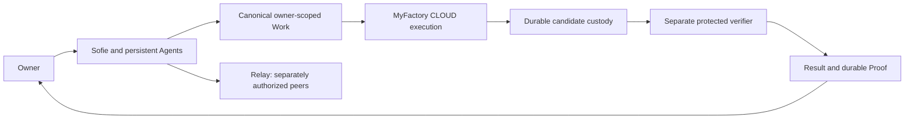

# MyEve

MyEve is the owner-facing application for a persistent personal AI agent. Sofie is its primary assistant: conversation, persistent specialists, private context, goals, Work, decisions, Files and verifiable Results live in one product. MyEve Builder configures and deploys an isolated installation from the same application source.

MyEve coordinates work; it does not treat a model response, a queued request or a healthy provider as proof that work succeeded. Substantial software work crosses a separate MyFactory execution boundary, and communication with other agents crosses independently authorized Relay boundaries.

## Contents

- [Current status](#current-status)
- [The three-repository system](#the-three-repository-system)
- [Product capabilities](#product-capabilities)
- [Proposed external-alpha exposure](#proposed-external-alpha-exposure)
- [Builder and installation model](#builder-and-installation-model)
- [Local development](#local-development)
- [Migrations, checks and deployment](#migrations-checks-and-deployment)
- [Operations and recovery](#operations-and-recovery)
- [Repository and documentation map](#repository-and-documentation-map)

## Current status

**Documentation reconciled: October 6, 2026 (Pacific).** Canonical source baseline: [`3e3d7a4`](https://github.com/jaydubya818/MyEveBot/commit/3e3d7a43179d12f7e99a16603e47d3764e65410f). This is a documentation baseline, not an assertion that every deployment runs this commit. Installation, source qualification, live qualification and owner authorization are separate facts.

| Area | Current engineering result | Availability boundary |
| --- | --- | --- |
| Owner A natural production CLOUD journey | Accepted PASS: natural Sofie interaction, real model execution, candidate custody, separate 11-check verifier, TestEvidence/DiffEvidence, durable Proof, owner readback and same-conversation recovery | One explicitly authorized bounded journey; not standing execution permission |
| Model-free production validation | PASS for lifecycle/grant atomicity, immutable preparation, custody, evidence transport, Proof, teardown and authority cleanup | Historical deterministic evidence; paid-path evidence is separate |
| Synthetic-owner isolation | Owner/session/data isolation qualified in bounded campaigns; B/C access to the completed Owner A artifacts denied | Does not automatically qualify new external-owner installations |
| Relay integration | Canonical identity/Passport/peer-policy path and bounded synthetic messaging qualified | Each real owner still requires its own authentication, enrollment and grants |
| Two real external testers | Preparation in progress; isolated resources/workspaces being prepared | **NOT_READY_TO_INVITE**; no access or invitation granted |
| Ordinary external-alpha chat/Work policy | Inactive foundation under [draft PR #65](https://github.com/jaydubya818/MyEveBot/pull/65); scoped review and CI passed | Not in this canonical baseline; ordinary Work/Factory integration and final qualification remain incomplete |
| Publication, generated PR/merge/deployment, automatic repair | Separate effect contracts exist in the ecosystem | Disabled for the proposed external alpha |

The successful CLOUD qualification establishes **zero local runtime dependencies**. Physical Mac power state was not independently observed. A successful bounded journey does not establish unrestricted Work readiness, arbitrary repository support, general availability, or permission to invite users.

The retained Result can remain **PARTIAL** even when the bounded execution journey passes: publication, external CI and owner acceptance are separate claims. Full production evidence is retained privately. This README summarizes engineering outcomes without publishing credentials, production resource identities, private paths or raw Result/Proof payloads.

Dated qualification documents describe the scope at their checkpoint. An older `NOT_RUN` or `NOT_READY` entry must not be presented as the current aggregate status, nor should it be rewritten as a historical success.

## The three-repository system

| Repository | Owns | Does not grant by itself |
| --- | --- | --- |
| **[MyEve](https://github.com/jaydubya818/MyEveBot)** | Owner conversation, Agents, private context, canonical Work, decisions, Current Truth and durable Proof consumption | Factory execution, another owner's data, publication |
| **[Relay](https://github.com/jaydubya818/relay)** | Agent identity, Passports, capability grants, policies, authenticated messaging and governed integration contracts | Shared Memory, unrestricted federation, Factory Work authority |
| **[MyFactory](https://github.com/jaydubya818/MyFactory)** | Admitted production execution, spend/writer fencing, candidate custody, independent verification and signed Result/evidence | Owner acceptance, repository publication, merges or deployment |



The Environment selects where work runs; a HarnessProvider selects how an admitted producer operates. Neither replaces owner identity, Work authority, model accounting or independent verification. Foreman/Linear issue delegation is a retained optional legacy integration, not a second automatic production stage. DeepAgent and alternative harnesses are experiments or deferred integrations until individually qualified.

## Product capabilities

### Sofie, conversations and continuity

- Authenticated owner chat with persisted threads and session binding, streamed responses, restored cursors and deduplicated events.
- Same-conversation continuation after a completed assistant turn. `session.waiting: next-user-message` is the normal next-owner-turn boundary, not an execution failure.
- Selected Work context and retained Work summaries keep explanations attached to the existing canonical Work, Result and Proof.
- Browser reconnect must restore the same durable Current Truth; it must not create another Work, candidate or paid dispatch.
- Model choice in ordinary owner chat is distinct from protected execution models. A bounded execution contract pins its own provider/model and fallback policy.
- Native tools remain subject to capability, scope, approval and execution checks; describing an action does not authorize it.

### Persistent Agents and Live Agent Cards

Owners can create specialists with durable names, purposes and instructions, inspect their profiles, and select the relevant Agent. The primary Agent is protected. Agent creation does not confer external capabilities or inherit another Agent's credentials.

Cards and home views expose persisted identity and available execution state. A card is an observation surface, not a worker lease or proof of completion. Specialist persistence and isolation have bounded qualification; every external tool or execution profile needs its own authority.

### Today, Goals, Work Inbox and Needs You

Goals, plans/tasks, paused Work and owner decisions feed the product's attention surfaces. Today summarizes canonical state; Work Inbox separates work and decisions requiring attention. Needs You and approvals expose explicit owner choices rather than treating silence as consent.

A canonical Work has owner/repository scope, version/generation and lifecycle. Preparation, admission, dispatch, candidate verification and completion are distinct transitions. Historical failures and previous attempts remain attributable. Refresh, reconnect and repeated observation do not reset counters or create fresh authority.

### Files, artifacts, Memory and Knowledge

- Files/artifacts use private custody, immutable revision identities and authenticated byte readback. Public sharing, where configured, is a separate exact-version, revocable action.
- Structured facts, preferences, observations and decisions are durable owner-scoped records. Semantic/long-term memory integrations require their own configured provider and qualification.
- Private Memory, conversations, Inbox, Files, Knowledge, preferences and connections default to private ownership.
- Retrieval must honor the active owner and context, including when Sofie participates in more than one private or shared context.
- A database fixture or UI persistence check does not establish that every natural-language remembering/retrieval behavior has been live-qualified.

### Private and shared-business context

| Internal scope | Product wording | Rule |
| --- | --- | --- |
| `OWNER_PRIVATE` | Private | Visible only within the owner's authorized private context |
| `BUSINESS_SHARED` | Shared with business | Explicit, durable sharing with authorized business owners |
| `WORK_SCOPED` | Shared for this Work | Bounded context access for one authorized Work; underlying private objects remain private |

Goals, Plans, Tasks, Work, Results, Proof, business artifacts/Knowledge, Decisions, Rooms and explicitly configured specialists may be shared when the corresponding surface is qualified. Sharing a deployment is never consent to share data. Work-scoped authorization ends under the Work policy; it does not promote private data into shared business state.

Connections and secrets remain owner/service-identity scoped. Sharing Work does not share credentials. Decisions can require a specific owner, either owner or both owners according to the effect policy. This is a small private/shared-business model, not generalized enterprise RBAC or SCIM.

### CLOUD Work, Result and Proof

The qualified bounded path is:

1. Natural owner intent resolves to canonical Work and an exact scoped authority.
2. Environment, source, HarnessProvider, FactoryVersion, model, pricing, operations, deadline and allowed effects are checked.
3. MyFactory admits one writer and a bounded candidate attempt under durable accounting.
4. Candidate bytes enter Factory custody; the producer is torn down/fenced before protected verification.
5. A separate verifier produces evidence for the exact candidate.
6. Authenticated EvidenceProvider transport delivers TestEvidence/DiffEvidence to MyEve's own durable custody.
7. MyEve independently verifies Work/Run/candidate/FactoryVersion/digest/byte bindings before admitting canonical Proof.
8. The originating owner reads the Result/Proof and reconnects to the same durable state.

Ambiguous paid-provider outcomes become UNKNOWN, retain conservative exposure and fence further dispatch. They do not authorize retry, fallback, a second candidate or budget reuse. Cleanup-only recovery cannot become productive continuation. Production authentication and Vercel deployment trust do not substitute for Work authorization.

The accepted line-ending fixture and its 11 protected checks do **not** qualify arbitrary software tasks. General external-alpha Work needs its own supported workspace/verifier policy before activation.

### Relay and optional integrations

Relay discovery, messaging, written responses and Knowledge exchange are separate capabilities. Messaging requires valid identities, current Passports where required, exact grants and receiving policy. Only explicitly authorized message/context bytes are shared. An acknowledgment proves delivery, not a substantive answer or completed Work.

The repository also contains optional integration surfaces for connected apps, email, Telegram, Slack, iMessage, phone/voice, local Mac access, cloud computer tools, push notifications and telemetry. Presence in source or the Builder catalog does not mean configured, live-qualified or included in this alpha. See the [environment example](apps/eve/.env.example) and [combined setup guide](docs/setup/myeve-relay-myfactory.md).

### Additional application and Builder catalog

These features remain discoverable in source and the Builder manifest; each deployment must expose only its qualified subset.

| Feature | What it provides | Important limit |
| --- | --- | --- |
| Search and command palette | Message-content search, navigation, new chat and management shortcuts | Results remain scoped to the authenticated owner |
| Message actions | Copy, edit/resend, regenerate and conversation fork | A fork does not inherit Work authority; a new model operation needs current budget |
| Goal OS | Versioned plans, milestones, task dependencies, progress, Focus and explainable next actions | A suggested next action is not execution permission |
| Outcomes and reviews | Owner feedback, deterministic daily/weekly priorities, blockers and retained review checkpoints | Feedback and acceptance stay separate from execution status |
| Reminders and event triggers | One-off/cron reminder contracts, webhook-triggered conversations and delivery history | External alpha keeps unqualified background execution disabled |
| Notifications | In-app unread state and configured push/channel destinations | Destination consent and channel authority remain explicit |
| Runtime skills | Skill creation/listing/management and installed skill catalog | Skill text cannot expand a capability or Work grant; execution snapshots pin qualified skills |
| Artifact workspace | Versioned documents, spreadsheets, presentations, comments, revision/restore and controlled sharing | Private custody and exact-version access checks remain required |
| Receipts | Durable spending receipt recording, querying and summaries | Receipt history is not permission to spend or proof of provider accounting completeness |
| Payments/cards | Optional Agentcard connection, consent and bounded card workflow source | Not part of the initial external-alpha allowlist |
| Voice/media | Optional realtime voice, phone streaming, image conversion and Remotion rendering | Provider/media execution requires separate configuration and limits |
| Observability/evaluations | OpenTelemetry and optional Braintrust/Raindrop export; routing, memory, safety and behavior evals | Export only under a reviewed privacy policy; evaluation calls may incur cost |

`/review` exposes review and outcome surfaces, `/agents` manages persistent identities, and `/manage` collects installation/settings views. Feature-manifest inclusion is not a claim that every mutation executor is enabled: unqualified operations, including some memory mutation paths, remain blocked.

## Proposed external-alpha exposure

All entries below are a **target allowlist**, not an invitation or activation claim.

| Prepare for the initial cohort | Keep disabled or withheld |
| --- | --- |
| Sofie/Chat; persistent Agents; qualified Agent Cards | Unqualified optional tools and unrestricted delegation |
| Today, Work Inbox, Needs You | Unqualified Routines and Rooms |
| Owner Files and qualified Memory | Inherited Files/Memory or connected credentials |
| Bounded owner-specific CLOUD Work and Result/Proof | OWNER_COMPUTER; publication; PR creation; merge; generated deployment; automatic repair |
| Qualified owner-facing Relay functionality | Unrestricted federation and unqualified Email/Connected Apps |

Each tester requires a unique owner identity, deployment, database, private store, session identity, Relay binding, Factory application/trust and private workspace repository. Service source repositories and other owners' repositories are outside tester scope. Existing Relay accounts must be authenticated before linking; matching an email is not proof of account ownership.

The inactive policy proposal reserves full allowances instead of recycling unused or uncertain exposure:

| Proposed bound | Ceiling |
| --- | --- |
| One Work | 5 aggregate model operations; $1.30; 180 productive seconds |
| Candidate / writer | 1 / 1 |
| Per-owner daily usage | 10 chat turns at $0.10 reserved per turn, at most 2 model operations per turn; 1 Work |
| Per-owner daily / five-day allocation | $2.30 / $11.50 |
| Combined two-owner daily / five-day allocation | $4.60 / $23.00 |
| Day boundary | Shared UTC midnight; 120-hour lifetime after explicit activation |

These are proposed fixed partitions, not active service guarantees. Ordinary Work/Factory integration, private-source materialization, appropriate protected verification, auxiliary paid-path fencing, deployment and per-tester qualification remain release gates. A provider account's monthly budget is not a substitute for these limits.

## Builder and installation model

`apps/builder` uses the actual `apps/eve` source as its template. It assembles selected features and instructions, provisions the configured resources, deploys through the Vercel API, and checks readiness. Feature-manifest checks prevent unmapped tools from silently entering a template.

Deployments carry template/release metadata for updates. Updating an existing managed installation must preserve its owner identity, private data, environment configuration and storage association. Provisioning a project, linking a service, activating paid authority and granting a tester access are separate steps.

The initial external alpha uses isolated installations rather than shared enterprise tenancy. Runtime credentials stay server-side. Do not copy an operator's, another tester's or a synthetic qualification owner's credentials into a new installation.

## Local development

Requirements: Node.js 24, npm, PostgreSQL/Neon for durable state, and a private artifact store for file flows. Configure model access only when deliberately testing model-backed behavior.

```bash
npm ci
cp apps/eve/.env.example apps/eve/.env.local
# Configure your own development database and owner identity first.
npm run db:migrations:check
npm run db:migrate
npm run dev --workspace=eve-agent -- --port 3001
```

Open `http://localhost:3001/chat`. The root `npm run dev` starts the default app and Builder development servers. Next.js mounts the Eve service under `/eve/v1/**`; wait for the Eve backend to start before testing chat.

| Configuration family | Purpose |
| --- | --- |
| `MYEVE_OWNER_ID`, `MYEVE_ACCESS_PASSWORD`, `MYEVE_SESSION_SECRET` | Stable deployment owner and authenticated web access |
| `DATABASE_URL` | Durable application state and migration ledger |
| `BLOB_READ_WRITE_TOKEN` | Private Files/artifact custody |
| Gateway workload identity / approved development configuration | Model transport authentication, separate from spend authority |
| `MYEVE_RELAY_*` | Explicit Relay integration |
| Factory installation/execution configuration | Qualified source, application, evidence and Work contracts; operator-installed |
| Optional provider variables in `.env.example` | Only the integrations explicitly configured for that installation |

Never commit `.env.local`, session cookies or provider credentials. Production and preview authentication must both fail closed. An example configuration is not a production execution contract.

## Migrations, checks and deployment

Migrations run through the explicit operator path, not automatically during every build or request. Ordered files, recorded checksums and transaction/locking rules must remain intact. The canonical baseline includes migration `0084`; rollout-specific requirements are defined by [database-schema.ts](apps/eve/lib/database-schema.ts). Draft migration `0085` belongs to the inactive external-alpha proposal and is not part of this baseline.

Use the qualified operator migration procedure when the selected database transport cannot apply a multi-statement file. Preserve file bytes and atomic ledger recording; do not mark an unapplied migration complete or edit historical migration bytes.

```bash
npm test                         # Core Node/script regressions
npm test --workspace=eve-agent    # Agent/application regressions
npm run typecheck                # Types, manifests and governance
npm run db:migrations:check       # File/order validation; no database mutation
npm run build
```

Integration suites require explicitly configured disposable databases. Provider/live tests may create resources or spend money and are not routine documentation checks. Skipped tests are not qualification passes.

Canonical `main` is the source reference. [Vercel configuration](apps/eve/vercel.json) disables automatic production deployment from `main`; an operator release is separate from a merge. Release verification must check the actual source/deployment identity, migrations, authenticated owner flow, denied foreign access, Work/evidence boundaries and cleanup. Health alone is insufficient.

## Operations and recovery

- Disable admission before investigating uncertain execution; retain accounting and existing evidence.
- Revoke sessions durably and verify retained-cookie rejection. Session revocation is separate from cancelling already-admitted Work.
- Stop/fence the exact Work and revoke its authority; verify producer/verifier teardown and no reusable grants.
- Roll back to a previously qualified deployment while preserving owner data and migration history.
- Keep provider credentials, private production evidence and exact runtime identifiers out of public documentation, bundles, model context and candidate artifacts.
- Real external invitations require a completed readiness matrix, owner-specific onboarding, spending/revocation controls and explicit cohort approval.

## Repository and documentation map

| Path | Contents |
| --- | --- |
| [`apps/eve/agent`](apps/eve/agent) | Eve channels, tools, instructions, skills and hooks |
| [`apps/eve/app`](apps/eve/app) | Product pages and authenticated API routes |
| [`apps/eve/lib`](apps/eve/lib) | Durable stores, identity, capabilities, Work, Relay and evidence integration |
| [`apps/eve/migrations`](apps/eve/migrations) | Ordered application schema history |
| [`apps/builder`](apps/builder) | Provisioning, feature assembly, deployment and updates |
| [Agent-native experience](docs/product/agent-native-work-experience.md) | Work in chat, Agent homes, Inbox and responsibility semantics |
| [Product guide](docs/private-alpha/PRODUCT-GUIDE.md) | Product surfaces and intended flows |
| [Combined setup](docs/setup/myeve-relay-myfactory.md) | Cross-repository configuration and boundaries |
| [Agent communication](docs/setup/agent-communication.md) | Peer setup and response acceptance |
| [Private-alpha checkpoint](docs/operations/external-alpha-qualification.md) | Dated synthetic-owner evidence and operating procedures |
| [Historical checkpoints](docs/verification/readme-historical-checkpoints.md) | Earlier results and their original limits |
| [Canonical source policy](docs/consolidation/DEVELOPMENT-POLICY.md) | Source durability and integration discipline |
| [Roadmap](docs/roadmap.md) | Product priorities; read with the current release gates above |
