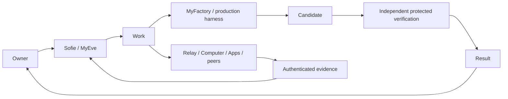

# MyEve

[Cloud execution migration](docs/architecture/cloud-execution.md): the local Factory provider seam is qualified, and dedicated staging database/private storage/hosted readiness are provisioned. The pinned managed image and hosted deterministic infrastructure lifecycle now pass, including private artifact readback after sandbox deletion; see the retained evidence. Cloud execution remains **NOT_READY**; Mac-off, independent cloud verification and the live canary are not yet qualified.

[Latest private-alpha qualification](docs/private-alpha/owner-publication-2026-10-02/README.md): Attempt 8 passed the first real local Sofie → MyFactory Golden Journey. The owner-decision and exact-candidate publication handoff is qualified; publication and owner acceptance remain separately gated. Historical Attempts 1–8 and the verified candidate remain immutable.

[Prior admission-proposal repair](docs/private-alpha/second-live-semantics-2026-10-01/README.md) preserves Attempts 1–2 and the captured-response handoff qualification. Attempt 3 subsequently proved live admission and stopped at executor model validation; the latest record above supersedes its preparation status.

Deploy a Digital Worker / personal AI agent you own, with persistent memory, goals, proactive work, and controlled access to your tools and computer. [Sofie](https://sofie-personal-agent.vercel.app) is the production reference agent. MyEve Builder configures and deploys your agent into your own Vercel account from this repository's actual source.

For example, ask Sofie to read a project's README on your Mac, explain the app, exchange a bounded question with an authorized peer, or hand a scoped software request to MyFactory. Each connection has its own setup and evidence: a configured tool is not proof that its remote service has completed the work.

## How the components fit together

| Component | Responsibility | Connection and boundary |
| --- | --- | --- |
| **MyEve / Sofie** | Owner conversation, persistent Agents, memory, Knowledge, goals, Work and results | Next.js and the Eve framework; owns local authorization and private context |
| **Relay** | Governed capability and communication fabric connecting Eves, specialists, Computers, Apps and compatible external agents | Registered identities, scoped grants and signed delivery; the receiving owner retains authority |
| **MyFactory** | Governed production system for substantial bounded Work | Canonical Work → PREPARE/START → execution → candidate custody → independent protected verification → Result; legacy Linear intake is a separate admission-only path |
| **Foreman** | Software-production workflow/factory capability used by the existing Linear/GitHub issue pipeline | Currently a separate legacy deployment, not the canonical MyFactory producer or a second automatic stage; it is not part of the canonical Work qualification |
| **DeepAgent / Deep Agents harness** | Experimental alternative agent execution loop behind a bounded harness interface | Isolated SDK experiment, **not registered in this deployed app and not production-qualified**; it does not replace Eve, Relay or MyFactory |

MyEve retains canonical Work, owner authority and Result state. MyFactory is the canonical bounded production path; the retained Foreman issue workflow is an optional legacy path with separate evidence. A harness executes within its admitted envelope. None can grant itself authority, verify its own candidate, or authorize publication.



Normal chat describes progress plainly: sent, received, working, verifying, then verified only when canonical evidence supports it. Tool names, identifiers, signatures and raw payloads remain available in **Proof of Work / Advanced**. A received WorkOrder is not a completed Result.

See [the combined setup and verification guide](docs/setup/myeve-relay-myfactory.md), [Mac setup](docs/local-mac-access.md), and [harness boundaries](docs/setup/deepagent-harness.md).

## Agent-to-agent communication

**Sofie can communicate with other authorized agents without sharing your credentials or automatically giving them access to your private information.** She can use the Relay adapter to discover registered peers, inspect their permissions, send an approved message, and retrieve its authenticated, correlated response. Peers may be other MyEve installations or agents and bots built on another platform. **Muse and GrokBots are intended peers, not automatically connected integrations:** each needs an actual identity/address, a compatible adapter, owner-authorized scopes and a running recipient.

- Messages share the message body and only explicitly authorized context. Private conversations, memory, Knowledge and local files are not shared automatically.
- Outbound messages use exact-action approval. Optional bounded automatic replies use only the receiving agent's approved public profile and the incoming message; they cannot invoke private tools or recursively answer replies.
- Knowledge retrieval requires an explicitly published view and its own grant. Messaging permission alone does not authorize Knowledge, file, computer or software execution access.
- `ACCEPTED` or `RUNNING` means pending; `COMPLETED` with only an acknowledgment proves delivery. A conversation passes only when the actual written reply is bound to the same request, conversation and peer. Poll the same request after uncertainty; do not resend it.
- Configuration and local tests are not a claim of a live Muse/GrokBots exchange. See [peer setup and acceptance](docs/setup/agent-communication.md) for the exact end-to-end checks.

Live checks on September 30, 2026 passed the original Mac README prompt, same-chat follow-up after task completion, MyFactory intake with signed receipt readback, and Sofie → Relay → Alpha → Sofie with an actual written answer. A second live MyEve installation, Muse and GrokBots still require their own acceptance checks. [See the recorded evidence and limits](docs/verification/connections-2026-09-30.md).

Example: “Ask the configured Alpha peer for a one-sentence acknowledgment through Relay, then show me its actual reply.” If the peer is absent, expired, offline or unable to answer, Sofie must report that state explicitly.

The ongoing [Computer and federation continuation](docs/verification/computer-federation-continuation-2026-09-30.md) records persistent login/restart, Keychain custody, canonical Computer grants, peer negotiation and outstanding live gates. The [first real Factory failure and handoff repair](docs/private-alpha/first-live-handoff-2026-09-30/README.md) are preserved separately; intake and local fixtures must not be read as a passing real production journey.

## Deployment and verification

The October 1 [task/session lifecycle repair and live qualification](docs/verification/task-session-lifecycle-2026-10-01.md) passed on canonical runtime `2efd2b70dfc27656966e2fe4ff46b01afd734835`. It fixes expired/completed standalone owner work blocking a fresh task while preserving one current binding, historical evidence, approval boundaries and consumed budgets. The original README prompt used real Mac discovery/read, completed, and accepted an unrelated Alpha request in the same conversation. Mac pairing, shell, screenshot, observed Calculator launch and automatic companion crash/restart passed. The native Send button and keyboard submission passed. Alpha returned an authenticated written reply through the generic federation adapter; this does not qualify unconfigured Muse/GrokBots or another MyEve installation.

The [earlier failed production sequence](docs/verification/computer-federation-production-2026-10-01.md) remains preserved as failed evidence. MyFactory intake/readback passed against the existing request; execution remains `DEFERRED_TO_PRIVATE_ALPHA_EXECUTION_OWNER`. This workstream did not initiate, resume or repair Factory execution. Newer canonical Private Alpha changes are preserved.

Feature readiness is connection-specific. [Mac acceptance evidence](docs/verification/local-mac-access-2026-09-30.md) records real README discovery, approval-gated shell execution and screenshot interpretation. [Current connection qualification](docs/verification/connections-2026-09-30.md) records the follow-up chat, MyFactory and peer-message checks for this change. A local SDK test or queued issue must not be presented as a completed production workflow.

The [canonical source status](docs/consolidation/CANONICAL-STATUS.md), [development policy](docs/consolidation/DEVELOPMENT-POLICY.md) and [historical checkpoints](docs/verification/readme-historical-checkpoints.md) retain source and release history.

## Finding current priorities

Current product priorities and shipped foundations are tracked in the canonical [MyEve roadmap](docs/roadmap.md). Dated files under `docs/plans/` are historical implementation records, not the current backlog.

## Using MyEve, Relay, and MyFactory together

Start with [the combined setup guide](docs/setup/myeve-relay-myfactory.md). It gives the setup order, configuration checklist, and a test that distinguishes a queued request from a locally received WorkOrder. MyEve chat works on its own; Relay and MyFactory are separate, opt-in connections.

| Component | What it owns | Where to use it |
| --- | --- | --- |
| MyEve / Sofie | Owner chat, Agents, goals, and requests to connected services | Your MyEve `/chat` and `/agents` pages |
| Relay | Scoped cross-agent capabilities, grants, and approvals | Your separately deployed Relay instance |
| MyFactory | Local WorkOrders, coding attempts, checks, and draft-PR proposals | The Mac work desk at `http://127.0.0.1:8788` |

For substantial production, create/select canonical **Work** and use the configured MyFactory route. The [MyFactory operator guide](docs/myfactory-operator.md) explains its budget, writer, custody and verification gates. Legacy **send a WorkOrder** uses signed Linear intake/readback; **delegate an issue to Foreman** uses the separate issue agent. Neither legacy acknowledgment establishes canonical execution or a verified Result.

## Filing and following a MyEve issue with Sofie

1. **Ask Sofie to file the issue.** In Sofie's chat, explicitly ask her to file a MYE issue and hand it to Foreman. Include a concise title, the desired outcome, relevant context (reproduction details or links), any constraints, acceptance criteria, and the priority. Sofie files one Linear issue from that context and returns its link after verifying the issue was saved.
2. **Confirm the delegation.** Open the issue in Linear and check that `myeve-foreman` appears as the delegated agent in Properties. Sofie's reply states whether the Foreman session has started or the delegation is still pending.
3. **Jump to the issue from Sofie's sidebar.** Use the **Linear issues** shortcut in Sofie's chat sidebar to open the Linear workspace in a new tab, then open the issue there.
4. **Find the Foreman session.** On the Linear issue, click **View progress** in Properties to open Foreman's agent session. The Activity feed also shows its work and updates.

## What it does

**Chat**

- **Web chat** — threads (rename/pin/delete), streaming responses, file attachments, slash-command prompts, model picker, and artifact previews.
- **Artifact workspace** — create, revise, restore, comment on, and share versioned documents, spreadsheets, presentations, and other generated files.
- **Email and file views** — first-class inbox and file-library routes alongside chat, goals, reviews, and agent management.
- **Command palette (⌘K)** — jump to threads, start a new chat, open goals or reviews, open the manage page, toggle notifications.
- **Full-text search** — sidebar search matches message content across all threads, not just titles.
- **Message actions** — copy a reply, edit & resend, regenerate the last reply, or fork a thread from any message.
- **Messaging channels** — private Telegram DMs, Slack, routed iMessage, dedicated SMS/iMessage/voice, and browser-based realtime voice. Each channel fails closed when its required owner or provider configuration is absent.

**Proactive**

- **Reminders & schedules** — ask Eve for one-off or recurring (cron) reminders; they fire into a new thread.
- **Event triggers** — Eve can mint webhook URLs so external services can start conversations.
- **Proactive delivery** — browser web push, Telegram, email, phone, iMessage, and Slack destinations when configured, plus unread indicators in the sidebar.

**Agent capabilities**

- **Persistent Agents** — one protected primary personal Agent plus owner-created specialists with durable identity, instructions, lifecycle, model preferences, explicit Relay capabilities, risk/cost/runtime limits, direct chat, and run attribution. Secondary Agents fail closed instead of borrowing the primary Agent's tools.
- **Goal OS** — persistent goals, versioned plans, milestones, tasks, dependencies, progress, Focus, and explainable next actions.
- **Outcome loop** — first-class effectiveness outcomes linked to goals, tasks, runs, and evidence; explicit owner feedback stays separate from execution status.
- **Daily brief and weekly review** — deterministic priorities, due work, blockers, completion, stalled-work, and dependency/capability risk signals from persisted state. Owner-controlled schedules create durable, deduplicated checkpoints and deliver them in-app or through a configured Web Push or Telegram channel.
- **Long-term memory** — Supermemory-backed scoped memory and retrieval. Authorized `remember` calls pass through the action gateway and verify the stored record before reporting success. Some mutation tools, including autonomous `forget`, remain blocked pending executor qualification.
- **App integrations** — Composio connections (Gmail, GitHub, Notion, Linear, …) with a UI to connect/disconnect apps.
- **Chat-created skills** — Eve can write, list, and delete her own skills at runtime; manage them from the UI.
- **Files and controlled sharing** — private Blob-backed uploads, immutable artifact revisions, authenticated content routes, and revocable exact-version share links.
- **Receipt tracking** — log/query/summarize spending, backed by Neon.
- **Computer control** — sandboxed browser tasks, a persistent Orgo cloud desktop, and an approval-gated local Mac bridge with explicit filesystem roots.
- **Agent communications** — an AgentMail inbox, custom email domains, Slack, routed iMessage, and a dedicated AgentPhone number.
- **Payments** — owner-approved Agentcard connection, verification, consent, wallet funding, and bounded virtual-card workflows.
- **Voice and media** — OpenAI realtime voice, inbound phone voice streaming, image conversion, and server-side Remotion video rendering.
- **Observability and evals** — privacy-aware OpenTelemetry, optional Braintrust and Raindrop export, plus routing, memory, safety, reminder, receipt, and persona evaluation suites.

**Review page** — `/review` generates the owner’s daily brief or weekly review and exposes recent outcome feedback.

**Agents page** — `/agents` creates, configures, pauses, resumes, duplicates, archives, and opens persistent Agents. Capability assignment and actual deployment availability are shown separately.

**Manage page** — `/manage` shows review schedules and delivery history, reminders (with run history), webhooks, memories, connections, and skills in one place.

**MyEve Builder (`apps/builder`)** — create a named personal agent and deploy it into **your** Vercel account, then update it later when the template changes:

- **Create** — wizard for name, personality, capabilities, channels, custom cron jobs, and editable generated instructions; one click deploys into the owner's Vercel account. The configured identity and instructions deterministically seed the deployment's protected primary Agent record.
- **Template** — the live `apps/eve` source, assembled at deploy time with feature pruning, so the personal agent and the product never drift. A manifest completeness check fails CI if a new tool isn't mapped to a feature.
- **Deploy** — Vercel REST API with the user's token: create project → set env vars → deploy inline files → stream build status → health check. Keys pass through in memory and are never stored; VAPID push keys are generated automatically; models bill to the deployer's own AI Gateway (no provider keys). Telegram webhooks register automatically when a bot token is provided.
- **Update** — each deployment is stamped with a template version (content hash), a monotonic release from `apps/eve/.eve-template-release` (bump that file when shipping changes agents should pick up), and an `eve-builder.json` manifest. When the builder's release is higher, the agent's `/manage` page shows an update banner that deep-links to the builder's `/update` page (not shown on the create home). The owner pastes their Vercel token and clicks once: the builder reads features, instructions, and custom schedules back from the deployed files, reassembles them on the latest template, and redeploys into the same project. Env vars, VAPID keys, storage, chat history, memories, skills, and the URL are preserved. Agents that predate the manifest need one Create-tab redeploy into the existing project before Update is available.

## Structure

```
apps/eve/         # the agent app (also the builder's deploy template)
  agent/          # eve agent: channels, tools, skills, schedules, instructions
  app/            # Next.js web chat UI + API routes (threads, search, update-check, …)
  components/     # UI components (Kumo design system)
  lib/            # Neon-backed stores (threads, push), Composio connect, web auth
apps/builder/     # the MyEve agent builder
  app/            # create/update UI + API routes (deploy, update, template-version, …)
  components/     # wizard + update flow
  lib/            # Vercel API client, feature manifest, assembler, generators
  scripts/        # manifest completeness check, manual smoke deploy
```

The Next.js app mounts the agent on the same origin via `withEve` — `/eve/v1/**` routes to the agent service. One dev server, one Vercel deployment.

### Capability readiness

Core chat, goals, reviews, agents, skills, reminders, and authenticated owner scoping ship with the application. Integrations are included but only become ready when their configuration is present:

| Capability | Required setup |
| --- | --- |
| Database-backed state | `DATABASE_URL` plus applied migrations |
| Artifacts and file sharing | Private Vercel Blob store |
| Connected apps | Composio or Vercel Connect credentials |
| Foreman issue delegation | Vercel Connect Linear authorization and the `FOREMAN_*` target settings |
| MyFactory hosted intake | A configured local host, Vercel Connect Linear authorization, and the `MYFACTORY_*` settings |
| Relay federation | Separate Relay installation, explicit owner grants, and the disabled-by-default `MYEVE_RELAY_*` settings |
| Email | AgentMail key or a key saved from `/email` |
| Cloud computer | Orgo key or a key saved under Manage → Computer |
| Local Mac control | Outbound paired Mac companion, `local-computer` feature, and per-action approvals; [setup](docs/local-mac-access.md) |
| Card workflows | Agentcard backend credentials, database, and admin token |
| Routed iMessage | Photon Spectrum router or an `IMESSAGE_ROUTER_URL` |
| Dedicated phone | AgentPhone key and admin token |
| Realtime browser voice | OpenAI API key |
| Telemetry export | Braintrust, Raindrop, or generic OTLP configuration |

Unavailable integrations stay disabled or report setup requirements; they do not silently inherit another agent's authority.

## Getting started

Requires Node 24.

```bash
npm install
cp apps/eve/.env.example apps/eve/.env.local   # then fill in values
npm run db:migrate
npm run dev --workspace=eve-agent -- --port 3001
```

Open [http://localhost:3001/chat](http://localhost:3001/chat). This command starts only the agent app and leaves port 3000 available for other projects. The root `npm run dev` command still uses the default app port 3000 and builder port 3100.

`next dev` automatically boots the eve agent backend and proxies to it. Wait for `[eve:dev] server listening at ...` before chatting.

### Environment

See [`apps/eve/.env.example`](apps/eve/.env.example) for the full annotated list. The essentials:

| Variable | Used for |
| --- | --- |
| `MYEVE_ACCESS_PASSWORD`, `MYEVE_SESSION_SECRET`, `MYEVE_OWNER_ID` | Single-owner production web access |
| `OWNER_TIMEZONE` | Default IANA timezone for owner-facing review schedules |
| `DATABASE_URL` | Neon Postgres (threads, goals, outcomes, reviews, reminders, webhooks, receipts, push) |
| `SUPERMEMORY_API_KEY` | Long-term memory |
| `COMPOSIO_API_KEY` | App integrations |
| `FOREMAN_*`, `NEXT_PUBLIC_LINEAR_WORKSPACE_URL` | Optional Sofie-to-Foreman delegation and sidebar shortcut |
| `MYFACTORY_*` | Optional signed MyFactory WorkOrder requests and receipt verification |
| `MYEVE_RELAY_*` | Optional, separately qualified Relay federation |
| `BLOB_READ_WRITE_TOKEN` | Private artifacts, file sharing, and skill store |
| `AGENTMAIL_*` | Agent inbox, custom domain, and inbound email webhook |
| `ORGO_*` | Persistent cloud desktop and computer tasks |
| `SOFIE_LOCAL_*` | Paired outbound Mac companion; shared-root reads and approval-gated shell/desktop changes |
| `AGENTCARD_*` | Card connection, verification, consent, and spending workflows |
| `SPECTRUM_*`, `IMESSAGE_*` | Shared-number iMessage router and pairing |
| `AGENTPHONE_*` | Dedicated phone, text, iMessage, and voice |
| `SLACK_CONNECT_CLIENT_ID`, `SLACK_OWNER_USER_ID` | Slack channel and owner authorization |
| `OPENAI_API_KEY` | Browser realtime voice |
| `BRAINTRUST_*`, `RAINDROP_WRITE_KEY`, `OTEL_*` | Optional tracing and evaluation export |
| `NEXT_PUBLIC_VAPID_PUBLIC_KEY`, `VAPID_PRIVATE_KEY` | Web push notifications |
| `TELEGRAM_BOT_TOKEN`, `TELEGRAM_WEBHOOK_SECRET_TOKEN`, `TELEGRAM_ALLOWED_USER_IDS`, `TELEGRAM_PROACTIVE_CHAT_ID` | Telegram channel and explicit proactive destination (optional) |

Before starting a local or deployed app, apply the checked-in database migrations:

```bash
npm run db:migrate
```

Migrations are ordered and checksum-protected; already-recorded migrations are skipped. The required migration is declared in [`apps/eve/lib/database-schema.ts`](apps/eve/lib/database-schema.ts); this source includes `0077_computer_revocation.sql`.

**Migration runner limitation:** the Neon HTTP runner rejects migration blocks containing multiple SQL statements with `cannot insert multiple commands into a prepared statement`. If encountered, apply the pending files through a PostgreSQL client, with each file and its migration-ledger entry in the same transaction. Preserve the original files and their SHA-256 checksums; do not mark an unapplied migration as complete.

Apply migrations to local, preview, and
production databases before the matching application release. Existing runtime table guards remain
temporarily for backwards compatibility; new schema changes must be added under
`apps/eve/migrations/` instead of application startup code.

Preview deployments use the same fail-closed owner authentication as production. Configure
`MYEVE_ACCESS_PASSWORD`, `MYEVE_SESSION_SECRET`, and `MYEVE_OWNER_ID` for the Vercel Preview
environment before qualification; do not weaken the auth boundary to make a preview testable.

## Chat and memory reliability

- Submitted prompts render immediately. Restored chats reconcile their saved stream cursor with the transcript and catch up with the durable session before accepting another message.
- Replayed events are deduplicated, and delayed persistence callbacks cannot overwrite the completed turn with an older cursor.
- Memory writes require an authenticated execution, an allowed capability, and an authorized owner/Agent/Goal/Task scope. Denied or uncertain results instruct the agent not to retry blindly or promise background saves.
- A missing `execution_occurrences` table means the configured database is behind the application schema. Apply the pending migrations to that database before retrying; changing the prompt will not repair the schema.

Focused regression checks:

```bash
cd apps/eve
npx vitest run lib/chat-session.test.ts lib/thread-sync.test.ts agent/tools/remember.test.ts agent/lib/memory-store.test.ts lib/action-authority.test.ts
npx tsc --noEmit
node --import tsx scripts/check-executor-governance.ts
```

Optional PostgreSQL integration checks use `ACTION_CONTEXT_TEST_DATABASE_URL` pointing to a **local test database** and require the `pg` package to be resolvable. They use temporary tables or an isolated schema that is removed after the test; the gateway test mocks the external memory provider.

```bash
# From apps/eve, after setting ACTION_CONTEXT_TEST_DATABASE_URL:
node --test test/action-context-sql.integration.mjs
npx vitest run agent/lib/remember-gateway.integration.test.mjs
```

## Scripts

- `npm run dev` — dev servers (agent app on :3000, builder on :3100)
- `npm run build` — production build
- `npm run db:migrate` — apply pending database migrations
- `npm run db:migrations:check` — validate migration order and files without a database
- `npm run typecheck` — TypeScript checks + builder manifest completeness
- `npm test` — core Node test suite
- `npm test --workspace=eve-agent` — agent, integration, API, and security regression suite
- `npm run eval:list --workspace=eve-agent` — list available agent evaluations
- `npm run eval:fast --workspace=eve-agent` — run the fast evaluation set
- `npm run eval:ci --workspace=eve-agent` — strict CI evaluations with JUnit output
- `VERCEL_TOKEN=… DATABASE_URL=… npx tsx apps/builder/scripts/smoke-deploy.ts` — manual end-to-end deploy test (creates and deletes a real project)

## Deploy

Sofie runs in the existing Vercel project `sofie-personal-agent`:

| Setting | Value |
| --- | --- |
| Production URL | [sofie-personal-agent.vercel.app](https://sofie-personal-agent.vercel.app) |
| Source repository | [jaydubya818/MyEveBot](https://github.com/jaydubya818/MyEveBot) |
| Production branch | `main` |
| Vercel root directory | `apps/eve` |
| Current template release | [The checked-in release number](apps/eve/.eve-template-release) |

The agent service is bundled into the Next.js deployment and routed under `/eve/v1/**`. The repository currently disables automatic deployment from `main` in `apps/eve/vercel.json`; production uses an explicitly approved manual release. Other enabled branches create previews. A canonical merge is not evidence of production activation.

Before shipping, run the repository checks from the root:

```bash
npm test
npm test --workspace=eve-agent
npm run typecheck
npm run db:migrations:check
npm run build
```

Database migrations must be applied before deploying application code that depends on them:

```bash
npm run db:migrate
```

For an intentional manual production deployment, use the linked application directory:

```bash
cd apps/eve
vercel deploy --prod --yes
```

After deployment, verify the Vercel deployment is Ready, confirm `/eve/v1/health`, and complete an authenticated conversation plus a sandboxed Computer task. A successful build alone is not production qualification.

## Private-alpha product expansion source

The isolated product candidate adds navigable Today/Work/Inbox/Needs You/Approvals/Files/Team/Apps/Computer surfaces, global search and weekly review over existing contracts. See the [product guide](docs/private-alpha/PRODUCT-GUIDE.md), [qualification dossier](docs/verification/private-alpha/README.md), [parity matrix](docs/private-alpha/PLUTO-PARITY.md), and [canonical integration crosswalk](docs/private-alpha/INTEGRATION-CROSSWALK.md).

These are historical product qualification records. Use the current source and connection evidence linked above for deployment claims; a qualified interface does not imply that every live provider or delivery path is enabled.

Private-alpha Attempt 5 completion repair and complete zero-model qualification: [evidence](docs/private-alpha/completion-transition-2026-10-01/README.md). Live retry remains unapproved.


MyFactory staging checkpoint [`1d31332`](https://github.com/jaydubya818/MyFactory/commit/1d3133273343d11833851c28c7f9c90cc302ec15) adds the canonical PostgreSQL V2 spend ledger and hosted private queue delivery. Connected queue completion occurred after the requesting process exited; duplicate submission reused the receipt. This is infrastructure qualification only. MyEve cloud Work routing, cloud harness, independent verifier and Mac-off/P0 remain unqualified; cloud admission and paid model calls remain disabled. The Attempt-8 publisher is unchanged.


The explicit cloud client transport now pins MyFactory staging HTTPS and serializes immutable repository source without laptop paths. Local transport remains loopback-only. The isolated Sofie qualification project/database are provisioned with canonical migrations and no copied owner data. [Evidence](docs/cloud-execution/phase-3/README.md). Full MyEve regression: 2,001 passed, 94 skipped; typecheck and executor governance passed. Cloud runtime admission remains blocked pending source/verifier integration; Mac-off/P0 is NOT_RUN.


Cloud execution snapshot V2 now pins the source tree, worker/verifier image digests, provider, policies, resource bounds, versioned skills and evidence class. MyEve verifies the same synthetic signed packet as Factory and rejects tampering and V1 downgrade. Cloud preparation requires V2 DETERMINISTIC evidence; local V1 behavior is retained. Validation: 2,003 tests passed, 94 skipped; typecheck, capability, skill routing and executor governance passed. Hosted cloud Work, verifier, Mac-off and P0 remain NOT_RUN. No paid models or publication were invoked.


The V2 cloud custody path now accepts a bounded Factory file projection without running local Git, recomputes the exact source tree, and applies the existing authenticated candidate/commit identity guard. The local V1 custody path and Attempt-8 publisher remain unchanged. Full validation: 2,005 passed, 94 skipped; typecheck/governance passed. Hosted cloud Work, independent verifier, Mac-off and P0 remain NOT_RUN.

Dedicated staging access approval is configured server-side only. A fixed operator probe and browser-bundle credential scan now guard the qualification path; hosted boundary tests are pending. All other isolated staging ingress remains closed until deterministic models are qualified. See [access boundary](docs/cloud-execution/phase-3/access-boundary.md).

The hosted bundle credential scan passed (77 files). The access matrix remains NOT_RUN: operator ingress to the separately protected Sofie staging project requires its own grant or authenticated Vercel session. No Sofie bypass has been created. The Factory bypass remains backend-only; canonical cloud Work and Mac-off/P0 remain NOT_RUN.


Dedicated Sofie CLOUD qualification now scans all four server credentials, including the explicitly approved Vercel runtime bypass, against browser bundles, prerendered HTML/hydration metadata, public files and public environment configuration. [Hosted build evidence](docs/cloud-execution/phase-3/sofie-runtime-bypass-build.json): containment and application-denial checks pass; Factory transport repair and canonical staging composition remain pending. Product status: **WAITING_FOR_CANONICAL_STAGING_COMPOSITION**. No paid model operations or production/publication changes.
