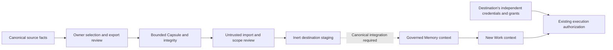

# Digital Worker / Builder architecture addendum

Integration-preparation update (2026-09-27): [current crosswalk and boundaries](integration-crosswalk.md). Supersedes older readiness/dependency notes below; core behavior remains accepted.

CAPSULE CORE: LOCALLY QUALIFIED

SECOND-EVE BENEFIT: PASS — deterministic fixtures

CANONICAL MEMORY EXPORT POLICY: INTEGRATION PENDING

CANONICAL ACTIVATION: INTEGRATION PENDING

LIVE DESIGN-PARTNER CAPSULE: NOT_RUN

A Memory Capsule sits before context selection, outside execution routing and authority custody:

There is no Capsule edge into provider authentication, repository grants, writer custody, FactoryVersion qualification, Factory routing, Relay relationships/inbox permissions, budgets or active Work ownership. Existing action authorization still controls every external effect. Role/Pack text describes behavior only after destination qualification.

A future Builder may offer an optional Capsule after it creates a new independent Eve identity. It must run the same preview, per-item decisions, scope checks and canonical promotion flow. Building an Eve must never imply inheriting the source owner's live access. Cross-owner and corporate-sharing flows are deferred.

The local golden journey demonstrates new-context retrieval after restart using an isolated fixture. It does not dispatch Factory Work, modify Gate B/C, claim a writer lease, reuse a source session, or qualify a live engineering worker. Those systems remain owned and tested by their existing workstreams.
