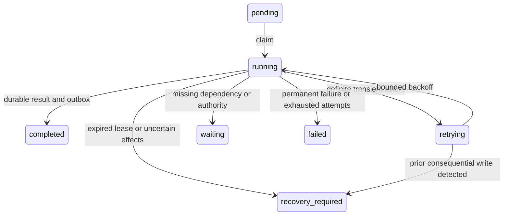
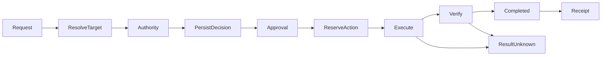
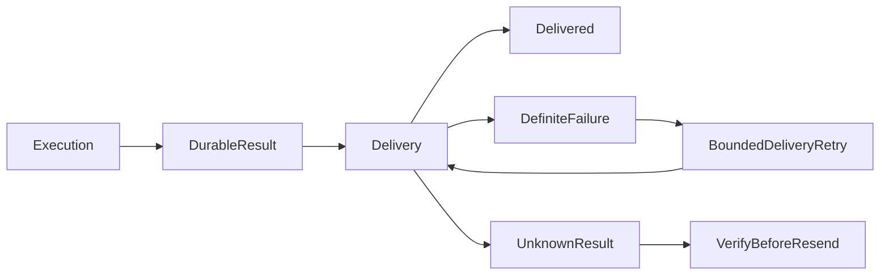

# Execution reliability and action gateway

## Architecture audit (2026-09-18)

Implementation base: `d683257`, incorporating the existing control center,
exact-action approvals, computer leases, and LiveSessionProvider. Main ends at
migration 0013; this dependency branch ends at 0022. New migrations start at 0023.
Older role branches reuse migration numbers and must not be merged by filename.
No shared database migrations are authorized for this work.

| Existing path | Identity / leases / retries / delivery | Decision |
|---|---|---|
| Reminders | Schedule ID; fixed five-minute claim; unbounded retries; channel receive combines work and notification | Extend with occurrences and independent delivery |
| Daily/weekly review | Owner/period uniqueness; checkpoint reuse; delivery claim and attempt ledger; bounded retries | Reuse delivery storage and preferences, preserve checkpoint generator |
| Webhook | Webhook identity, no event occurrence identity; starts conversation directly | Extend with bounded trigger authority and event identity |
| Background web conversation | New thread per call; best-effort push; no durable execution claim | Extend with occurrence/session binding |
| Eve schedules | Durable runtime, but interrupted tool execution can replay | Retain runtime; add durable action boundary |
| task_runs / agent_runs | Canonical work and executor attribution, budgets, evidence | Reuse, never introduce a second Run |
| Approvals | Canonical task_approval_decisions; redacted parameter hash; no universal execution consumer | Extend exact binding and consume through gateway |
| Computer | Existing action ledger, control version and live provider | Reuse control fence and action/evidence linkage |
| Composio / provider tools | Dynamic connector execution | Adopt gateway at actual provider invocation |
| Capability registry | Risk, availability, approvals, evidence | Remains source of policy |

## Required execution contracts

A routine is versioned configuration and bounded authority. An occurrence identifies
one trigger event or scheduled instant. An attempt records a worker's effort; it is
not a new Run. A claim includes a renewable lease and monotonically increasing
fencing version. All worker writes must match that version and an unexpired lease.

Actions resolve account/resource identity before deterministic authorization.
Exact hashes use complete canonical parameters; UI summaries are separately redacted.
An external request is marked executing before transmission. A crash or ambiguous
response leaves an unknown outcome: recovery must establish provider state before
retry. Provider idempotency keys are stable across attempts.

Execution commits its result before delivery is enqueued. Delivery retries never
invoke the agent. A provider timeout may leave delivery unknown too: notifications
are external writes and must not be blindly repeated.

## Scope and rollout

Preserve Eve, existing runs, approval center, evidence, computer leases and delivery
preferences. Additive schema only. No historical runnable backfill. Validate with
isolated PostgreSQL and fake providers before requesting real-provider qualification.
No production deployment or shared Neon changes are part of local qualification.

Future Relay supplies an AuthorityProvider, intersected with local policy. Browser
profiles supply authentication, never authority. Teach a Workflow will produce a
routine, skill, trigger, authority manifest, budget and checks. It will not add an
execution runtime. External agents submit work requests, never invoke owner tools.

## Current implementation status

This is a foundation in progress, not a completed rollout. The new worker and
gateway are not yet invoked by production schedules or tools. Do not interpret
passing foundation tests as qualification of end-to-end autonomous execution.

Implemented and exercised against isolated PostgreSQL:

- Additive migration 0023, with owner-scoped routine versions and deterministic
  occurrences linked to canonical task_runs.
- Atomic claims, renewable leases, claim-version fencing and append-only attempts.
- Bounded transient retry, terminal-failure auto-pause, one pause event and resume.
- Unknown/interrupted execution requires recovery; unsafe writes prevent claiming
  a retry. Recovery does not automatically re-enter the agent.
- Result commit and outbox enqueue are atomic. Delivery uses Phase 3 tables and
  cannot invoke the agent. Definite notification failures have bounded retries;
  ambiguous transmission blocks retry.
- Provider-independent action reservation, persisted parameter binding, verification
  receipts and replay refusal. Exact approval hashes retain the complete original
  JSON values; display redaction is separate.
- Computer gateway reservations extend the existing control lease. An unresolved
  reservation intentionally blocks takeover until provider recovery is implemented.

Outstanding before activation:

1. Decide legacy authority migration: owner review before next run, or a reviewed
   read-only default with external writes held for approval. No inferred grants.
2. Wire authenticated occurrence context and session attribution through Eve;
   enforce routine authority for every tool and connector, including child agents.
3. Integrate reminders, webhooks, reviews, browser mutations, a connected-app write
   and notification adapters; preserve existing delivery preferences.
4. Wire approval continuation and deterministic provider recovery. The gateway's
   approval record is reused, but the runtime resume path is not yet integrated.
5. Implement provider health preflight/circuit state, routine budget accounting,
   owner configuration/version changes and missed-schedule policy adapters.
6. Build Control Center routine/occurrence/action views, safe controls and timeline.
7. Qualify remaining authority/approval/computer races, redaction, budgets and
   browser UX with fixtures; run build and document deployment procedure.

The migration must not be applied to a shared database until the complete rollout
has been qualified. No application activation flag has been added to imply readiness.

## State contracts

Costs are stored as known, estimated or unknown; missing provider cost is never a
zero-cost claim. Routine/agent/goal aggregation and enforcement remain outstanding.
Metrics can derive from occurrence/attempt/action/outbox records without retaining
raw tool payloads. Broader provider interfaces should be introduced only by the
adapter that needs them. Existing ComputerProvider and LiveSessionProvider remain
authoritative for environment execution.

## Qualification evidence for the foundation

- `npm test`: 130 passed.
- `npm test --workspace=eve-agent`: 397 passed, including binding and retry contracts.
- `npm run typecheck`: passed, including capability registry and builder manifest.
- `npm run db:migrations:check`: 23 ordered migrations validated.
- `npx tsx apps/eve/test/execution-reliability.integration.mjs`: passed against a
  disposable schema on local PostgreSQL port 55439. The fixture deliberately does
  not read DATABASE_URL or environment files and drops its schema after testing.
  Covers two database connections racing for claims/actions, fenced workers,
  delivery failure/recovery without rerunning work, unknown-result refusal,
  changed parameters, unavailable authority/target, synthetic secret redaction,
  auto-pause and a single owner event, and resume preserving attempt history.
- `npm run build`: blocked by Turbopack CSS worker `EPERM` while binding a local
  port, including the elevated retry. Production build qualification is incomplete.

Not exercised: real external providers, production accounts, approval continuation,
browser/mobile UI, or rollout to existing schedules. No shared Neon migration,
deployment, external message, or provider resource was created.
