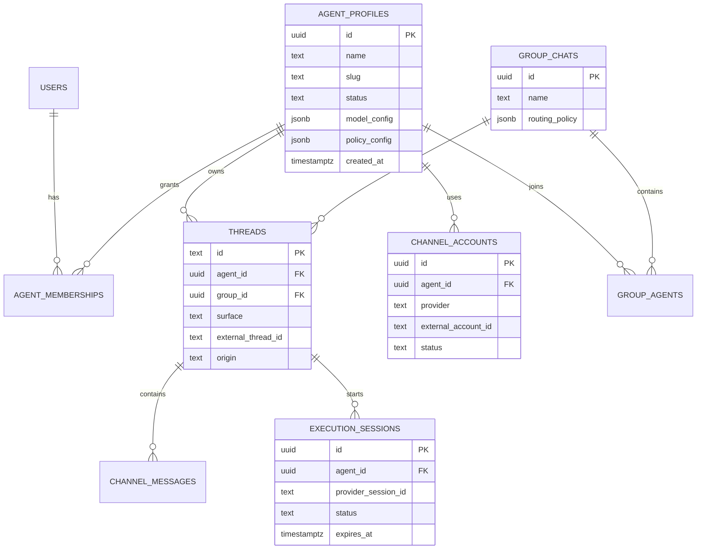

> Historical implementation plan. Shipped items are reconciled below through work orders 001–010. Use [`docs/roadmap.md`](../roadmap.md) for current priorities and sequencing.

# Agent operations hub and channel workspaces

## Executive recommendation

Do not add thirteen navigation labels and fill them later. The screenshots describe three different products that need to be separated deliberately:

1. **Manage** — configure one agent and inspect its capabilities.
2. **Workspaces** — use email, files, a sandbox, and a remote computer.
3. **Organization** — create persistent agents and groups and route conversations between them.

Ship them in that order. The current app already has useful foundations for reminders, triggers, memory, connections, skills, receipts, browser control, and threads. The fastest credible V1 is a better operations hub around those working capabilities, followed by communication channels. Persistent multi-agent orchestration and real payment cards should not be allowed to hold up that release.

Recommended release sequence:

| Release | Outcome | Included |
| --- | --- | --- |
| Phase 0 | Safe, repeatable baseline | auth, dependency remediation, automated smoke tests, explicit setup health |
| V1 | Finished single-agent operations hub | Appearance, Reminders, Triggers, Memory, Connections, Skills, Finance (receipts), responsive Manage navigation |
| V1.1 | Agent communication desk | Channels overview, Slack, agent Email, Files |
| V1.2 | Supervised execution | Workspace and Computer session UI, Phone after provider choice |
| V2 | Persistent agent organization | Agents, agent-scoped threads, groups, group routing |
| Decision-gated | Money movement | Card issuing and Billing after provider, compliance, and liability decisions |

This avoids feature sprawl while still moving toward the product shown in the references.

## Problem this solves

The current Eve app is a capable chat surface, but the user cannot answer basic operational questions without talking to the agent:

- What capabilities are configured, healthy, or unavailable?
- Which reminders, triggers, memories, integrations, and skills exist?
- What email, Slack, phone, or browser activity belongs to this agent?
- What files did it create and what computer session is currently active?
- What has it spent or recorded?
- If multiple agents exist, which agent owns a thread and how do they coordinate?

The proposed hub makes those states visible and controllable. It should feel calm and trustworthy: a control plane for an agent, not a collection of demo pages.

## Product principles

1. **Configuration is not capability.** A feature may be included in a deployment but missing credentials, disconnected, degraded, or healthy. Represent those states explicitly.
2. **No empty promises.** Hide a section only when it was intentionally excluded. If it was included but needs setup or has failed, show a setup or error state.
3. **Human approval for consequential actions.** Sending messages, deleting durable data, controlling a remote computer, and spending money need clear confirmation policies and audit records.
4. **One source of truth per concept.** Card spend, recorded receipts, and infrastructure billing are separate ledgers and must not be blended.
5. **Persistent product agents are not framework subagents.** Eve subagents are execution primitives; user-created agents require durable identity, ownership, policy, and routing.
6. **Every surface has loading, empty, error, ready, and disconnected states.** An empty array must not mask a failed API request.
7. **Mobile uses drill-down navigation.** A thirteen-item horizontal tab strip is not acceptable on a phone.

## Evidence and test baseline

Tested locally on 2026-09-12 with Node 24.18.1 and npm 11.16.0.

### Passed

- `npm ci` completed (764 packages).
- `npm run typecheck` passed for both workspaces. The first sandboxed attempt was blocked by a local `tsx` IPC permission, then passed outside that sandbox restriction.
- `npm run build` passed for `apps/eve` and `apps/builder`.
- Eve health check returned HTTP 200 with `status: "ready"`.
- The Eve chat, Manage page, and builder wizard rendered on desktop.
- Manage rendered at a 390 × 844 mobile viewport.
- Automated accessibility checks reported zero WCAG 2 A/AA violations on the tested Eve Manage, mobile Manage, and builder pages. One selected-tab contrast check was inconclusive because the element was visually obscured during evaluation.
- Browser console contained no application errors during the static UI checks.

### Blocked or failed for environmental reasons

- A canonical Eve session was created, but the model stream failed with HTTP 401 because no AI Gateway credential was configured.
- Database-backed threads, automations, and receipts could not be exercised because `DATABASE_URL` was absent. The web UI fell back to local storage for threads.
- Memory, Connections, and Skills were hidden because their respective Supermemory, Composio, and Blob credentials were absent.
- The local Manage page therefore showed only Reminders and Triggers.

### Launch blockers found

- `npm audit` reported 13 advisories: 5 moderate, 7 high, and 1 critical. The critical advisory affects the resolved Next.js 16.3.0; a fix is available in 16.3.3 or newer. All advisories need triage and a clean or explicitly accepted production result.
- There is no committed unit, route, integration, or browser E2E test suite. CI currently validates install, typecheck, and build only.
- Production web access is intentionally anonymous: `requireWebAuth()` always allows requests and the Eve channel includes `none()`. That is incompatible with personal communications, computer access, or money-related features.
- Four Turbopack warnings are emitted for dynamic filesystem access in the builder deployment assembler. The build passes, but tracing the whole project increases deployment risk and should be corrected.
- Current API failure handling often converts a failed request into an empty list. This makes an unavailable database look like “no reminders” or “no memories.”

## Current architecture

### What is reusable

- The app is a Next.js 16 + React 19 client backed by the Eve runtime on the same origin.
- The shared sidebar supports thread search, rename, pin, delete, busy state, unread state, and deep linking between chat and Manage.
- The Manage panel already implements Reminders, Triggers, Memory, Connections, and Skills.
- Optional capabilities are baked by the builder and conditionally exposed by `/api/features`.
- Receipt tools already store amounts as integer cents and support logging, querying, summarizing, and deletion.
- The agent sandbox already boots browser control using `@agent-browser/eve` and Vercel Sandbox.
- Telegram, Composio, Blob, Supermemory, Neon, and web push integrations already exist.
- The builder can prune features, inject generated instructions, provision environment variables, deploy, and update an existing agent.

### What must change

- `apps/eve/app/chat.tsx` is a 2,700+ line client component with a `"chat" | "manage"` view union. Adding five workspaces and multi-agent routing directly to it will make state coupling worse.
- `apps/eve/components/manage-panel.tsx` is an 800+ line component with a horizontal tab list and feature-specific data fetching in one place.
- `/api/features` returns four booleans, even though the builder defines eight optional capabilities. It cannot distinguish excluded, included-but-unconfigured, connected, or unhealthy states.
- `web_chat_threads` has no owner, agent, group, channel, or external-thread fields. Its origin supports only web, reminder, and webhook.
- Database schema changes are performed lazily with `CREATE TABLE` and `ALTER TABLE` inside application code. Multi-table agent and channel data requires a real migration path.
- Current Eve declared subagents are static code-authored workers and built-in delegated agents start with fresh context. Neither is a durable user-created-agent model.

## Repository ownership decision

The former `apps/eve` mirror depended on an inaccessible `boringcomputers/ruth` repository and prevented independent product development. On 2026-09-12, the Product Owner approved making this repository Sofie&rsquo;s source of truth.

Implemented consequences:

1. The CI job that rejected direct `apps/eve` changes was removed.
2. The scheduled Ruth sync workflow and obsolete sync script were removed.
3. CI continues to enforce manifest completeness, typecheck, unit tests, and production builds.
4. Builder deployments still use `apps/eve` as their checked-in template and keep the existing template-release/update mechanism.

## Proposed information architecture

```text
Agent app
├── Agent/sidebar context
│   ├── Current agent identity and health
│   ├── Activity: Chat, Email, Files, Workspace, Computer
│   ├── Threads
│   ├── Agents (V2)
│   └── Groups (V2)
└── Manage
    ├── General
    │   └── Appearance
    ├── Automation
    │   ├── Reminders
    │   └── Triggers
    ├── Knowledge and tools
    │   ├── Memory
    │   ├── Connections
    │   └── Skills
    ├── Communication
    │   ├── Channels overview
    │   ├── Email
    │   ├── Slack
    │   └── Phone
    ├── Operations
    │   ├── Computer
    │   ├── Finance
    │   └── Card
    └── Account
        └── Billing
```

Desktop Manage should use a narrow section list and a detail pane. Mobile should show the section list first, then navigate to a full-width detail view with a clear Back action. Each section needs a stable URL such as `/manage/reminders`; browser back/forward and direct links must work.

### Naming recommendations

- Rename **Messages** to **Channels** unless it is intended to be a true unified inbox. “Messages” alongside Slack and Phone is otherwise ambiguous.
- Define **Finance** as the receipt and spending record already present in Eve.
- Define **Card** as the agent-controlled payment instrument and its controls.
- Define **Billing** as the cost of running Eve: model, sandbox, storage, channel, and platform usage. It is not card spend.
- Keep **Email** in the primary activity navigation after it has a functioning inbox. Its setup and policy live under Manage → Channels/Email.

## Section scope

| Section | V1 behavior | Required states | Notes |
| --- | --- | --- | --- |
| Appearance | name, avatar, description, theme, timezone, locale | saving, saved, validation error | Keep system instructions separate from cosmetic appearance. Builder-created name must remain compatible. |
| Reminders | list, create, edit, pause/resume, delete, run history | loading, empty, unavailable, error, active, paused, firing | Creation can still be available through chat, but UI editing should be first-class. |
| Triggers | list, copy URL, enable/disable, rotate secret, delete, run history | loading, empty, failed delivery, disabled, active | Never display secrets again after rotation; distinguish URL from signing secret. |
| Memory | search, inspect source/time, forget with confirmation | loading, empty, disconnected, degraded, error | Show why Memory is unavailable instead of hiding a selected capability. |
| Connections | list apps, connect, reconnect, revoke, last-used status | OAuth pending, callback success/failure, expired, healthy | Support multiple accounts only after an explicit account-selection model exists. |
| Skills | list, inspect, create/edit, disable, delete, version metadata | loading, empty, parse error, save conflict | Preserve chat-created skills and add clear provenance. |
| Computer | policy and live session inventory; open workspace | idle, starting, running, stopping, failed, expired | The Manage page owns policy; the primary Computer view owns live interaction. |
| Finance | receipt list, filters, categories, summary, correction trail | loading, empty, unavailable, partial import, error | Read-only summary first; do not imply bank-account truth. |
| Channels | overview of configured communication adapters | excluded, setup required, pending, healthy, degraded, revoked | Recommended replacement for ambiguous “Messages.” |
| Slack | connect workspace, scopes, allowed conversations, disconnect | pending install, connected, token failure, event failure | Prefer first-class Eve Slack/Vercel Connect integration over a generic tool connection. |
| Email | agent address, inbound/outbound policy, sender allowlist | provisioning, active, suspended, bounce, delivery failure | Inbox is a primary workspace; settings belong here. |
| Phone | number, SMS/voice policy, allowed senders, quiet hours | provisioning, active, consent blocked, delivery failure | Provider choice is a product decision; see Decision 3. |
| Card | provider connection, status, limits, approvals, freeze | not eligible, KYC/KYB, active, frozen, declined, disputed | Decision-gated and not in initial V1. Never render raw card data from our server. |
| Billing | infrastructure usage and invoices | trial, current, past due, unavailable | Deployer-owned billing may need links out to vendors before a unified ledger exists. |

## Primary workspaces

### Chat

Preserve the current thread experience. Add an explicit agent owner to the header only after persistent agents exist. A thread must never silently change agents.

### Email

Provide three panes on desktop: folders, thread list, message detail. On mobile, each pane becomes a route-level drill down. Minimum folders: Inbox, Unread, Sent, All mail, Trash. Required operations:

- search by sender, recipient, subject, and body;
- open a conversation and preserve provider threading IDs;
- compose, reply, forward, archive, mark unread, and move to trash;
- render safe attachments and download originals;
- show sending, sent, bounced, and failed states;
- require approval before the agent sends externally unless an explicit narrow policy permits it;
- deduplicate inbound webhooks and make sending idempotent.

Recommended provider short list:

- **AgentMail through Vercel Marketplace/Connect** for purpose-built agent inboxes and domains.
- **Chat SDK email adapter** if a supported provider already fits the deployment and its state adapter is made durable.

Do not build a custom SMTP/IMAP client for V1.

### Files

Start as an artifact and shared-file inventory, not a general cloud drive. Show filename, type, size, source thread, owning agent, created time, retention, and share status. Reuse Blob for durable shared files while keeping sandbox-only temporary files clearly labeled. Add preview for safe formats and explicit delete/revoke actions.

### Workspace

Represent a single execution session: files, command/output history, artifacts, and status. It is a session-scoped view, not a permanent desktop. Show when the sandbox expires and what will be retained.

### Computer

Embed or link to the active browser session with clear control state: viewing, requesting control, controlling, agent controlling, stopped, expired, failed. Include stop, take over, release control, and open artifact. Never surface stored credentials or sandbox environment secrets in the UI.

## Proposed application architecture

### 1. Extract a route-aware application shell

Create focused modules instead of expanding `chat.tsx`:

```text
app/
  (agent)/
    layout.tsx
    page.tsx                     # chat
    manage/[section]/page.tsx
    email/[[...path]]/page.tsx
    files/page.tsx
    workspace/[sessionId]/page.tsx
    computer/[sessionId]/page.tsx
components/
  app-shell/
  manage/
  email/
  files/
  workspace/
  computer/
```

The shell owns agent identity, navigation, responsive sidebar state, command palette, and global capability health. Each workspace owns its own data and errors. Preserve existing `/` and `/manage` URLs with redirects or defaults.

### 2. Replace feature booleans with capability status

Return a typed registry from a protected endpoint:

```ts
type CapabilityState =
  | "excluded"
  | "setup_required"
  | "connecting"
  | "ready"
  | "degraded"
  | "error";

interface CapabilityStatus {
  id: CapabilityId;
  state: CapabilityState;
  reason?: string;
  action?: { label: string; href: string };
  checkedAt: string;
}
```

Do not return secrets or secret-derived values. Cache expensive health checks briefly, but do not cache a failed credential forever. UI navigation should derive from the registry:

- `excluded`: do not show.
- `setup_required`: show with a setup badge.
- `degraded` or `error`: show with an issue badge and recovery action.
- `ready`: show normal content.

### 3. Introduce a Manage section registry

Define each section as a small descriptor: id, label, group, icon, capability dependency, route, badge selector, and component. This makes ordering and builder pruning explicit without keeping all fetch logic in one component.

### 4. Standardize asynchronous resource states

Every section should use a discriminated state such as `idle | loading | empty | ready | error | disconnected`. API errors must remain errors. For optimistic deletion:

1. ask for confirmation when the operation is destructive;
2. keep the removed record for rollback;
3. call the API with an idempotency key;
4. restore the record and display a retry action on failure;
5. announce success or failure accessibly.

### 5. Establish migrations before adding product entities

Use a checked-in migration tool or ordered SQL migrations rather than more runtime `ALTER TABLE` calls. The exact library can follow upstream conventions; choosing one is an implementation decision, not a product decision. It must support local, preview, and production application plus rollback guidance.

## Persistent agent and group model (V2)

Treat a product agent as a durable profile and policy boundary. Eve framework subagents can be used internally for delegated execution, but they are not the database record users see in the sidebar.



Implementation constraints:

- Exactly one of `agent_id` and `group_id` must own a thread.
- Existing threads backfill to a generated primary agent without changing thread IDs.
- Agent ownership is checked server-side on every read and mutation.
- Channel credentials remain in the provider or secret store; database rows store only non-secret external identifiers and health metadata.
- Group routing must be explicit: moderator, round-robin, directed mention, or parallel synthesis. Do not allow all agents to respond recursively.
- Each agent needs its own model/instruction/tool/channel policy. A display profile alone is insufficient.
- Deleting an agent should be soft-delete plus a review of threads, files, channels, and schedules. Permanent deletion is a separate export/retention workflow.

### Architecture decision required before V2

Two viable execution models need a short spike:

| Model | Benefits | Costs |
| --- | --- | --- |
| One Eve deployment with data-driven profiles | one UI and database; fast switching; lower ops cost | requires dynamic instruction/tool isolation and strong per-agent routing; larger blast radius |
| One Eve deployment per persistent agent | strongest policy and secret isolation; aligns with current builder | cross-agent groups, shared UI, updates, and billing become operationally complex |

Recommendation: prototype the single-deployment model first, but approve it only if tool, channel, memory, and secret boundaries can be enforced server-side. Otherwise, keep one primary agent in V1 and defer organization features.

## Channel architecture

### Slack

Use Eve's first-class Slack channel with Vercel Connect when the deployment model supports it. This provides managed installation, verified events, short-lived runtime credentials, DMs, mentions, thread context, and human-in-the-loop interactions. The generic Composio connection can remain a tool integration but should not be treated as the inbound Slack channel.

Minimum controls:

- workspace identity and installer;
- granted scopes;
- allowed channels or DMs;
- mention-only versus proactive response policy;
- last verified event and last error;
- reconnect and revoke;
- idempotent event processing and thread mapping;
- durable adapter state in production.

### Phone and messaging

Choose one initial scope:

1. **Linq/Vercel Connect** — managed iMessage, RCS, and SMS. Best match for the transcript's iMessage experience.
2. **Eve Twilio channel** — SMS and speech-transcribed calls. Broader telephony control, but carries consent, opt-out, number provisioning, recording, and regional compliance work.

Recommendation: if iMessage is essential, validate Linq availability and onboarding first. Otherwise, ship SMS-only through the existing Eve Twilio channel and add voice later. Do not call a speech-to-text call log a full voice agent until interruption, latency, consent, and escalation flows have been validated.

For every inbound provider:

- verify webhook signatures before parsing payloads;
- acknowledge within the provider timeout;
- enqueue durable processing;
- deduplicate by provider event ID;
- enforce sender/workspace allowlists;
- record a redacted audit event;
- map replies to the correct agent and thread;
- fail closed when identity or policy is ambiguous.

## Card and billing safety gate

Card is not a navigation task. It is a regulated financial product with real loss exposure. It should remain unavailable until the Product Owner selects a provider and accepts the compliance and liability model.

Required controls before a sandbox pilot:

- approved use case and geographic eligibility;
- KYB/KYC and beneficial-owner flows;
- provider-hosted display for PAN/CVC so sensitive data never reaches Eve's server;
- per-agent and per-user card ownership;
- amount, time-window, merchant-category, and country controls;
- “approval required” as the default for agent-initiated spend;
- an immutable authorization decision and audit trail;
- idempotent purchase intent, authorization, capture, reversal, refund, and dispute handling;
- immediate freeze and global kill switch;
- webhook signature verification and replay protection;
- reconciliation against provider truth;
- clear declined, offline, partial-capture, late-presentment, refund, and dispute states;
- support runbook for suspected fraud and lost access.

If Stripe Issuing is selected, authorization decisions have a strict response window and spending controls may not be an instantaneous aggregate ledger. The design must not rely on the UI total alone to prevent overspend.

Billing can ship earlier as read-only outbound links and estimated usage. A consolidated in-app bill should wait until there is a reliable ingestion and reconciliation model for AI Gateway, Vercel, storage, sandboxes, channels, and any product subscription.

## Implementation phases

### Phase 0 — make the baseline shippable

**Goal:** create a secure, repeatable foundation before exposing personal data or consequential controls.

- [x] Upgrade Next.js to a non-vulnerable current patch (at least 16.3.3 for the identified critical advisory), regenerate the lockfile, and rerun audit/build.
- [x] Triage every remaining direct and transitive advisory; document any accepted risk with owner and expiry.
- [x] Replace anonymous production access with a real user/session boundary in both the Eve channel and Next route handlers. Preserve `localDev()` only for local development.
- [x] Add server-side authorization checks to threads, automations, memory, connections, skills, files, and all new routes.
- [x] Add a startup/readiness report for required environment and provider connectivity without disclosing secrets.
- [x] Stop converting failed automations/memory requests into empty arrays.
- [x] Add an error boundary and structured error response shape with request IDs.
- [x] Fix builder dynamic-path tracing warnings by constraining the deploy template root and tracing inputs.
- [x] Establish checked-in database migrations and a migration application strategy.
- [ ] Add an automated test stack and CI jobs:
  - [x] route/unit contract tests for capability states, auth, builder validation, task lifecycle, and evidence redaction;
  - [x] CI gates for type checking, migration validation, Node tests, and production builds;
  - database integration tests against an isolated Postgres/Neon branch;
  - Playwright smoke tests for chat, Manage, builder, responsive navigation, and error states;
  - an Eve session contract test using a test credential or mocked model boundary;
  - accessibility checks on all route-level surfaces.
- [ ] Add `.env.example` validation and a documented local test profile.
- [x] Replace the fixed-delay Local/Preview identity assertion with bounded route-readiness markers.
- [ ] Rerun the six-check QA suite against a fresh isolated Preview and close the prior identity result as a timing false positive only if the stored rerun evidence passes.

**Acceptance criteria**

- Production routes reject an unauthenticated request.
- Local development remains usable without weakening production.
- CI fails on type errors, build errors, manifest gaps, failed migrations, route tests, and browser smoke tests.
- A missing database renders “Database setup required,” not an empty reminder list.
- Owner-scoped list/query endpoints are bounded, and authentication endpoints enforce rate limits before communication channels expand the public attack surface.
- No critical/high dependency advisory remains without an explicit time-bounded acceptance.

### Phase 1 — V1 Manage operations hub

**Goal:** give one agent a complete and trustworthy management surface.

- [x] Extract the route-aware app shell and preserve existing chat behavior.
- [x] Implement list/detail Manage navigation with stable URLs and mobile drill-down.
- [x] Introduce the typed section registry and capability-status endpoint.
- [x] Split existing Reminders, Triggers, Memory, Connections, and Skills into focused modules.
- [x] Preserve counts and run history while adding loading, setup, error, and retry states.
- [x] Add confirmation, rollback, and success feedback to destructive actions.
- [x] Add Appearance with name, avatar, theme, timezone, and locale.
- [x] Add Finance as a receipt list/summary using the existing receipt store.
- [ ] Add receipt query API endpoints with pagination, filters, input validation, and ownership.
- [ ] Add keyboard focus management and screen-reader announcements for section navigation.
- [x] Update builder feature definitions, generated instructions, feature manifest, and template release as required.

**Acceptance criteria**

- All V1 sections are directly linkable and restore correctly on refresh/back/forward.
- Desktop and mobile navigation can reach every included section without horizontal scrolling.
- Excluded, setup-required, healthy, degraded, and error capabilities are visually distinct.
- Finance totals use integer-cents source data and display currency explicitly.
- Existing threads, reminders, triggers, memories, connections, skills, and builder updates do not regress.

### Phase 2 — V1.1 communication desk

**Goal:** make inbound and outbound work visible while keeping user approval and routing explicit.

- [ ] Add a Channels overview and select the Email and Slack providers.
- [ ] Implement Slack installation, event verification, durable state, reconnect, and revoke.
- [ ] Provision one agent email inbox and expose its address/status in Manage.
- [ ] Implement email folder, search, thread, compose, reply, attachment, delivery, and failure flows.
- [ ] Add provider-event tables and idempotency constraints.
- [ ] Add a Files inventory sourced from email attachments, chat uploads, agent artifacts, and shared Blob files.
- [ ] Add outbound-approval policy and audit events for email and Slack.
- [ ] Add retention, deletion, and redaction rules for messages and attachments.

**Acceptance criteria**

- Duplicate webhook delivery creates one message/event.
- Replies preserve external threading and map to one internal thread.
- Failed sends remain visible with a safe retry action.
- Unauthorized senders and workspaces cannot reach the agent.
- The user can identify what the agent sent, why, under which policy, and whether it succeeded.

### Phase 3 — V1.2 supervised Workspace, Computer, and Phone

**Goal:** expose agent execution without turning the interface into an unsafe remote shell.

- [x] Add execution-session records and API contracts.
- [x] Build Workspace status, files, command/output history, expiry, and retained-artifact views.
- [x] Build Computer live-session view with view/take-over/release/stop controls.
- [x] Enforce owner checks, short-lived access tokens, session expiry, and audit events.
- [x] Define network and credential policies for sandbox sessions.
- [ ] Select Linq or Twilio for the first phone/message scope.
- [ ] Implement number provisioning/connection, sender allowlist, consent/opt-out, quiet hours, delivery state, and revoke.
- [ ] Add voice only after a separate latency, consent, interruption, transcription, and failure test plan passes.

**Acceptance criteria**

- A user cannot view or control another user's session.
- Stopping a session is immediate, idempotent, and clearly confirmed.
- Expired sessions cannot be reopened with a stale token.
- Persistent files and ephemeral sandbox files are visibly distinct.
- Phone/SMS events are verified, deduplicated, allowlisted, and auditable.

### Phase 4 — V2 persistent agents and groups

**Goal:** support multiple durable agents without weakening ownership or policy boundaries.

- [x] Complete the single- versus multi-deployment architecture spike.
- [ ] Add agent profiles, memberships, channel accounts, and ownership migrations.
- [x] Backfill all existing data to one primary agent.
- [ ] Add agent creation, edit, pause, archive, and safe deletion flows.
- [ ] Scope instructions, model, tools, memory, schedules, channels, files, and policies per agent.
- [x] Add agent-scoped navigation and thread search.
- [ ] Add group records, membership, and an explicit routing policy.
- [ ] Add loop prevention, turn budgets, attribution, and stop controls to group execution.
- [x] Show which agent authored each response and which agent currently has control.

**Acceptance criteria**

- Every durable record has one verified owner and agent/group scope.
- Existing users see their prior data under a primary agent without loss.
- Pausing an agent stops new proactive/channel work but preserves data.
- A group cannot recurse indefinitely or cause unbounded model/tool spend.
- Each response and side effect is attributable to one agent and one policy decision.

### Phase 5 — Card and billing (decision-gated)

**Goal:** introduce money movement only after provider and compliance approval.

- [ ] Approve provider, program, supported countries, funding model, liability, and support ownership.
- [ ] Complete provider sandbox onboarding and threat model.
- [ ] Implement hosted card-data components and never proxy PAN/CVC.
- [ ] Implement card lifecycle, limits, freeze, replace, and approval policy.
- [ ] Implement authorization webhook response, idempotency, timeouts, default behavior, and audit.
- [ ] Reconcile authorizations, captures, reversals, refunds, and disputes.
- [ ] Add incident monitoring and global spending kill switch.
- [ ] Keep Billing usage/invoices in a separate schema and UI.

**Acceptance criteria**

- No agent can create or approve its own unrestricted spend policy.
- Default-deny behavior is defined and tested for provider/API timeout.
- Duplicate or replayed events cannot duplicate a purchase or approval.
- The user can freeze all cards independently of the agent runtime.
- Provider ledger and internal ledger reconcile with alerting for mismatches.
- Compliance, security, finance, and Product Owner approvals are recorded before live mode.

## API and data contracts to define

Before implementation, write request/response schemas for:

- `GET /api/capabilities`
- `GET/PATCH /api/settings/appearance`
- `GET/POST/PATCH/DELETE /api/automations`
- `GET/DELETE /api/memories`
- `GET/POST/DELETE /api/connections`
- `GET/POST/PATCH/DELETE /api/skills`
- `GET /api/finance/receipts` and `GET /api/finance/summary`
- `GET /api/files` and safe preview/download/revoke endpoints
- `GET/POST /api/execution-sessions` and stop/control mutations
- channel setup/status/callback/revoke endpoints
- agent and group CRUD after the V2 architecture decision
- card intents, approvals, status, freeze, and webhook endpoints only in Phase 5

All mutations should include:

- authenticated owner and agent scope;
- Zod or equivalent input validation;
- idempotency for external side effects;
- consistent error codes and request IDs;
- audit metadata for consequential actions;
- rate and concurrency limits appropriate to the provider.

## Test matrix

| Area | Unit/route | Integration | Browser E2E | Operational |
| --- | --- | --- | --- | --- |
| Auth/ownership | route denial, scope checks | session + database ownership | sign-in/out, forbidden deep link | revoked session |
| Capabilities | state derivation | provider health timeout | setup/error/ready UI | credential revoke |
| Manage | reducers and validation | database mutations | desktop/mobile nav, focus, retry | partial provider outage |
| Email/Slack/Phone | signatures, dedupe, policy | provider sandbox/webhooks | compose/reply/failure | replay, rate limit, expired token |
| Files | MIME/size/ownership | Blob and sandbox lifecycle | preview/download/revoke | malware/unsafe preview policy |
| Computer | state machine, access token | sandbox create/stop/expiry | view/take over/release | orphan cleanup |
| Agents/groups | routing and loop budget | migration and isolation | switch/pause/group attribution | runaway-cost alert |
| Card | approvals, limits, idempotency | provider sandbox reconciliation | freeze/decline/refund/dispute | timeout, webhook replay, kill switch |
| Builder/update | manifest and transforms | deploy/update preservation | wizard paths | rollback failed deployment |

For every user-facing surface, explicitly test loading, empty, setup-required, disconnected, degraded, error, success, slow network, offline/retry, narrow mobile, keyboard-only, and screen-reader paths.

## Observability and audit

Add structured events with correlation IDs for:

- authentication and authorization denial;
- capability health changes;
- automation creation, mutation, firing, and failure;
- channel install, revoke, inbound event, outbound intent, approval, send, and delivery;
- execution session creation, takeover, stop, expiry, and failure;
- agent/group routing and budget stop;
- card intent, approval, authorization, capture, reversal, refund, dispute, freeze, and reconciliation.

Logs must redact message bodies, attachments, tokens, secrets, card data, and unnecessary personal information. The UI audit view should show human-readable actors and outcomes without exposing protected payloads.

Suggested initial service-level indicators:

- successful model turn rate and latency;
- channel event verification and processing success;
- outbound send success and retry rate;
- reminder delivery success;
- active/orphaned sandbox count and stop latency;
- authorization decision latency and reconciliation mismatch count if Card ships.

## Rollout and migration

1. Land Phase 0 behind no new user-visible feature flags.
2. Release the new Manage shell with old sections first and compare behavior.
3. Add Appearance and Finance behind builder/deployment feature flags.
4. Migrate current feature booleans to capability states with backward-compatible defaults.
5. Pilot Slack and Email with one internal deployment and provider sandbox/test accounts.
6. Add Files after real email/agent artifacts exist; avoid a permanently empty page.
7. Pilot Workspace/Computer with short session TTLs and owner-only access.
8. Backfill a primary agent before showing Agents navigation.
9. Keep Card hidden from navigation until the financial safety gate is approved.
10. For each upstream app release, sync into eveclaw, bump the template release, deploy a fresh agent, update an old agent, and verify that history/configuration survive.

Rollback requirements:

- additive database migrations first; destructive cleanup only in a later release;
- old app code must tolerate new nullable columns during rollout;
- channel installs can be revoked without deleting message history;
- agent/group UI can be disabled while preserving primary-agent access;
- card kill switch must be independent of an application rollback.

## Risks and mitigations

| Risk | Impact | Mitigation |
| --- | --- | --- |
| Shipping all sections together | long delay and shallow, empty UI | phased release and no-placeholder rule |
| Anonymous production app | data exposure and unauthorized side effects | Phase 0 authentication/ownership gate |
| Treating Eve subagents as persistent product agents | lost context and weak isolation | durable profile model and architecture spike |
| Expanding monolithic client components | regressions and hard-to-test state | route-aware shell and focused modules |
| Provider lock-in | expensive migrations | channel contracts and external ID abstraction, without inventing a generic provider framework prematurely |
| Hidden degraded services | user believes data is empty or safe | explicit capability/resource error states |
| Group-agent loops | runaway spend and side effects | moderator policy, turn budget, attribution, global stop |
| Computer/session credential leakage | account compromise | short-lived scoped access, no secret rendering, owner checks, TTL |
| Card fraud or compliance failure | direct financial and legal harm | decision gate, provider-hosted sensitive UI, approvals, limits, reconciliation, kill switch |
| Mirror workflow drift | CI failure or overwritten work | implement upstream, sync, then update builder manifest/release |

## Decisions required from the Product Owner

These choices materially change implementation and should be approved before their phase starts:

1. **Scope:** approve the phased release, especially deferring persistent agents/groups and Card from V1. Recommended: approve.
2. **Messages label:** Channels overview or a real unified inbox? Recommended: Channels overview for V1.1.
3. **Phone:** Linq for iMessage/RCS/SMS, or Twilio for SMS/voice? Recommended: validate Linq if iMessage is core; otherwise Twilio SMS first.
4. **Persistent agent runtime:** one data-driven Eve deployment or one deployment per agent? Recommended: run the isolation spike before committing.
5. **Card provider and program:** Stripe Issuing or another provider, supported countries, funding model, and liability owner. No default should be assumed.
6. **Billing model:** outbound links/estimated vendor usage or a SellerFi/Eve consolidated subscription and usage ledger? Recommended: links and estimates first.
7. **Authentication:** resolved for the single-owner V1 with a signed, seven-day owner session, same-origin mutation checks, and rate-limited login. Revisit an external identity provider before multi-user or shared-agent access.

## Definition of done

The initiative is complete only when:

- the app is authenticated and every record/mutation is owner scoped;
- each included navigation item has a working end-to-end flow and complete states;
- desktop, mobile, keyboard, and assistive-technology paths pass;
- builder create and update flows preserve configuration and durable data;
- automated tests cover critical happy and failure paths;
- operational dashboards and runbooks exist for channels and computer sessions;
- persistent agents/groups meet isolation and cost-control criteria if enabled;
- Card remains disabled until its separate financial readiness criteria pass;
- no direct edits bypass the upstream `boringcomputers/ruth` mirror workflow.

## Internal references

- `README.md:1-90` — existing capabilities, environment, builder, and update model.
- `.github/workflows/ci.yml:9-42` — upstream mirror guard and current CI checks.
- `apps/eve/app/chat.tsx:580-619` — current two-view state.
- `apps/eve/app/chat.tsx:1037-1193` — current shared sidebar and Manage branch.
- `apps/eve/components/manage-panel.tsx:530-662` — current feature flags, fetching, optimistic deletes, and tab derivation.
- `apps/eve/app/api/features/route.ts:9-46` — current feature/environment booleans.
- `apps/eve/lib/threads-db.ts:13-55` — current lazy schema and thread-origin model.
- `apps/eve/lib/web-auth.ts:1-9` — current anonymous route behavior.
- `apps/eve/agent/channels/eve.ts:1-12` — current anonymous Eve channel auth.
- `apps/eve/agent/agent.ts:1-92` — current dynamic model/reasoning selection.
- `apps/eve/agent/sandbox.ts:1-14` — current browser sandbox foundation.
- `apps/eve/agent/lib/receipts-db.ts:1-49` — receipt storage and integer-money representation.
- `apps/builder/lib/config.ts` and `apps/builder/lib/manifest.ts` — feature selection and template pruning.
- `apps/builder/lib/assemble.ts:100-170` — template release, hashing, and deploy assembly.
- `apps/eve/PLAN.md` — earlier OpenClaw gap analysis and channel direction.
- User-provided screenshots and transcript, 2026-09-12 — target navigation and multi-agent/product context.

## External references

- [Eve documentation](https://eve.dev/docs) — framework runtime, channels, subagents, approvals, and security model. Installed version documentation should remain the implementation source of truth.
- [Vercel Connect](https://vercel.com/connect) and [Slack integration](https://vercel.com/connect/slack) — managed installations, scoped runtime credentials, event forwarding, and Slack channel support.
- [Vercel Connect catalog](https://vercel.com/connect/browse) — current AgentMail, Photon, Linq, and financial-service integration availability.
- [AgentMail on Vercel Marketplace](https://vercel.com/changelog/agentmail-vercel-marketplace) — programmatic inboxes/domains, threads, attachments, and real-time events.
- [Chat SDK Photon support](https://vercel.com/changelog/chat-sdk-adds-photon-support) — current email adapter option.
- [Vercel Connect Linq support](https://vercel.com/changelog/vercel-connect-now-supports-linq) — managed iMessage, RCS, and SMS option.
- [Twilio webhook security guidance](https://www.twilio.com/docs/usage/webhooks/webhooks-security) — signature validation for inbound telephony events.
- [Stripe Issuing spending controls](https://docs.stripe.com/issuing/controls/spending-controls), [authorizations](https://docs.stripe.com/issuing/purchases/authorizations), and [fraud controls](https://docs.stripe.com/issuing/manage-fraud) — control limits, authorization timing, and risk protections.
- [Stripe Issuing embedded components](https://docs.stripe.com/issuing/connect/embedded-components) — provider-hosted sensitive card display.
- [Stripe Issuing onboarding](https://docs.stripe.com/issuing/onboarding-overview) — program approval and compliance dependencies.
- [PCI SSC tokenization guidance](https://www.pcisecuritystandards.org/faqs/1326/) — tokenization scope considerations.
