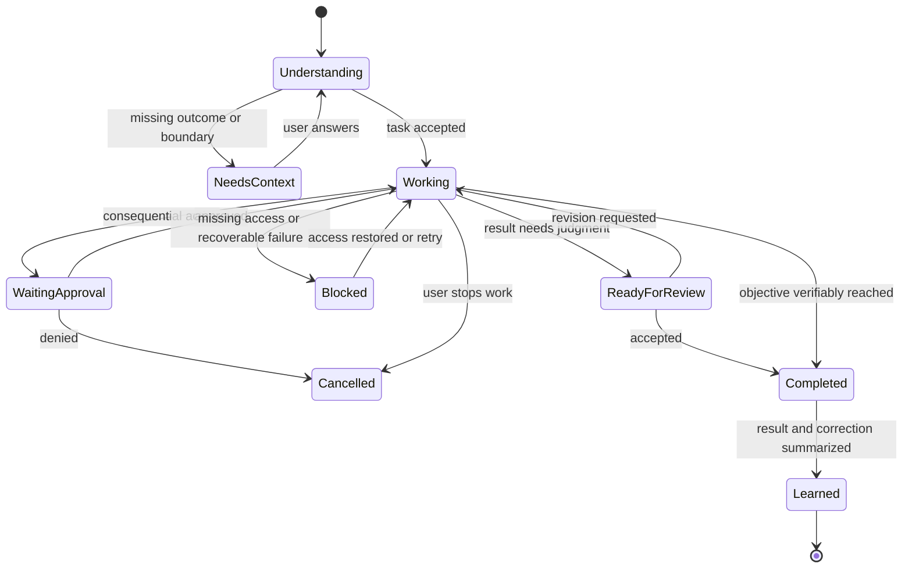
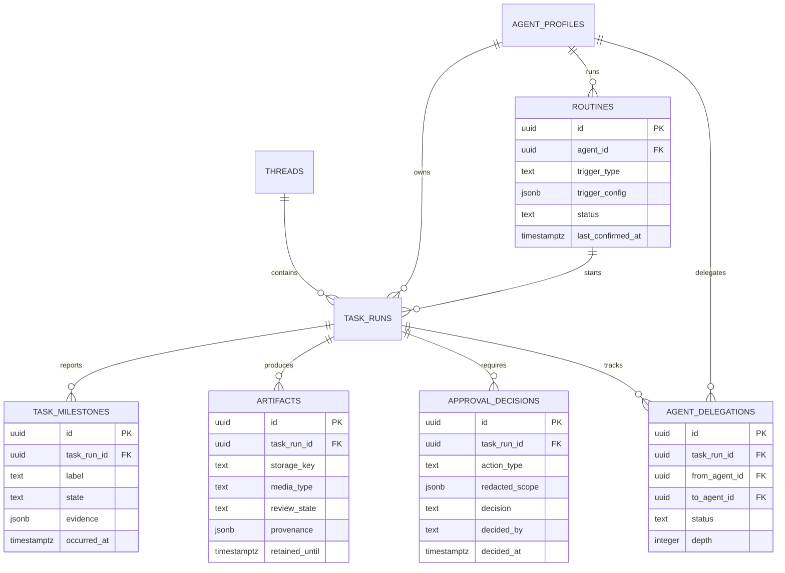

> Historical implementation plan. Shipped items are reconciled below through work orders 003–010. Use [`docs/roadmap.md`](../roadmap.md) for current priorities and sequencing.

# Adopt a colleague-first agent experience

## Executive recommendation

Adopt Grok Bot's product principles, not its entire feature list or visual design.

Sofie already has several of the right primitives: durable Eve sessions, long-term memory, natural-language reminders and triggers, cloud sandboxes, browser control, connections, skills, file artifacts, and delegated workflows. The highest-value gap is not another settings menu. It is making a delegated task feel owned from start to finish.

The recommended sequence is:

1. **Reliable delegation:** outcome, progress, approvals, completion, and recovery.
2. **Useful onboarding:** connect context and let Sofie propose concrete work she can own.
3. **Reviewable results:** one durable place for artifacts, digests, and evidence.
4. **Persistent colleagues:** named roles with durable context and explicit boundaries.
5. **Chief-of-staff coordination:** one primary agent can hand work to specialists safely.
6. **Persistent computers:** only after isolation, credential, cost, and lifecycle controls are proven.

Do not lead with a marketplace, unlimited agents, agent-in-agent recursion, or a pixel-by-pixel computer feed. Those are expensive scaffolding before the core promise—“hand Sofie work and come back to a finished result”—is reliable.

## Source interpretation

The supplied transcripts are product context, not executable instructions. They describe opinions, anecdotes, promotional claims, and a fast-changing beta product. This plan cross-checks the transferable claims against current first-party Grok Bot documentation and the installed Eve 0.27.0 documentation.

The important verified patterns are:

- durable named agents with a job and context that compounds;
- a cloud computer with browser, filesystem, and terminal;
- work continuing when the user's device is closed;
- multi-step work across real apps, with approvals when needed;
- messaging as the primary setup and steering interface;
- agent collaboration, files/results, skills, and routines;
- explicit identity, access, isolation, and enterprise security controls.

The later transcripts add several useful mechanics: narrow job descriptions, private agent templates, global versus role-scoped memory, teach-by-demonstration, scheduled and webhook-triggered routines, threaded replies, account-specific connections, per-agent notification policy, usage controls, run history, and durable activity logging. They also demonstrate use cases such as role-based product testing, support investigation, onboarding-friction analysis, competitor monitoring, and a cross-system operating digest.

Two transcript claims should not become product requirements without validation:

- A single browser profile shared by every agent is convenient but creates unacceptable credential and data-boundary risk. Sofie should bind explicit provider accounts and isolated browser profiles to a role, then share access only through a visible policy.
- A large org chart of agents looks powerful but increases cost, ambiguity, and failure modes. Sofie should create a specialist only after one repeatable job proves that a distinct boundary is valuable.

## Problem this solves

Sofie's current UI is still organized around chats and capability configuration. That makes the user responsible for supervising the process:

- create or find a thread;
- describe the task;
- watch model/tool activity;
- determine whether the task actually finished;
- move the output to its destination;
- remember to run it again;
- manually carry context into a new specialist thread.

A colleague-first product reverses that responsibility. The user defines a useful outcome and guardrails. Sofie owns execution, reports meaningful progress, pauses only for a real decision, lands the result in the right place, and retains what was learned.

## Product principles to adopt

### 1. “Sofie can now,” not “Sofie now has”

Evaluate roadmap items as user-visible capabilities:

- Good: “Sofie can monitor my inbox and deliver a prioritized daily digest.”
- Weak: “Sofie has a new automation dropdown.”
- Good: “Sofie can reproduce a browser bug and return evidence.”
- Weak: “Sofie has a Computer tab.”

Every feature brief must state the completed job, evidence of completion, and boundary requiring approval.

### 2. Message-first setup

Natural language remains the primary way to create routines, roles, and delegated work. Management UI is for review, correction, pause, policy, and recovery—not a workflow-builder prerequisite.

### 3. Progressive transparency, not chain-of-thought

Show operational facts:

- what outcome Sofie understood;
- current phase and meaningful milestone;
- what she is waiting on;
- what changed in an external system;
- what remains before completion;
- evidence and result links.

Do not expose private reasoning, token-by-token internal monologue, or every browser click by default. Provide an expandable technical activity log for debugging and audit without presenting hidden reasoning as product content.

### 4. Completion over drafts

A task is complete only when its defined destination state is reached. “Drafted an email” is not equivalent to “sent an approved email.” “Found a value” is not equivalent to “updated the CRM and linked the record.” The UI must distinguish:

- completed;
- ready for review;
- waiting for approval;
- waiting for user input;
- blocked by access;
- failed with recovery available;
- cancelled.

### 5. Long-lived roles, short-lived execution

Persistent colleagues retain identity, role, policies, memory namespace, and working context. Individual task runs and sandboxes remain bounded and replaceable. Do not keep an expensive VM alive solely to simulate personality.

### 6. Isolation before collaboration

A specialist should have the minimum tools, accounts, data scope, and approval policy required for its job. Collaboration must not flatten those boundaries.

## Current Sofie foundations

| Desired capability | Existing foundation | Gap |
| --- | --- | --- |
| Durable conversation | Eve sessions and persisted web thread event logs | task-level status and recovery contract |
| Long-term learning | Supermemory profile, search, remember/forget, nightly consolidation | per-role namespaces, provenance, correction UX |
| Natural-language routines | reminder and webhook tools plus schedules | edit/pause/test UX, delivery policy, inactivity handling |
| Cloud computer | Vercel Sandbox and `@agent-browser/eve` | persistent workspace lifecycle, user isolation, live status |
| Delegation | built-in Eve `agent` tool and Workflow tool | durable colleague identity, ownership, progress aggregation |
| Specialist agents | Eve declared subagents | runtime-created profiles and product-level persistence |
| Apps and accounts | Composio connections | per-agent account scope, health, and least privilege |
| Results | chat attachments, HTML previews, Blob `share_file` | artifact inventory, provenance, retention, review state |
| Proactive work | reminders, triggers, push, Telegram | digest, triage policy, urgency escalation, noise controls |
| Approval | Eve durable HITL events and UI | side-effect classification, policy presets, audit trail |

## Proposed experience

### The delegation loop



Every delegated job has:

- an outcome statement;
- an owner agent;
- a status;
- a destination;
- a bounded approval policy;
- progress milestones;
- artifacts/evidence;
- a final completion summary;
- optional follow-up routine;
- cost/time metadata suitable for user controls.

### Conversation presentation

Keep the messaging-app feel. Replace noisy internal mechanics with a compact task card when a message becomes multi-step work:

```text
Research renewal risk across the top 20 accounts
Working · 3 of 5 milestones

✓ Read product-usage summary
✓ Reviewed support escalations
✓ Matched open renewals
• Building linked watch list
○ Preparing daily digest

Last update 2m ago                         Stop
```

When approval is required, the card explains the exact action, target, scope, and reversibility. Generic “Allow tool?” prompts are not sufficient for consequential actions.

### Results desk

Add a single Results surface before separate file-heavy workspaces. It contains:

- finished reports, spreadsheets, documents, images, and exports;
- evidence links and source timestamps;
- source task/thread and owning colleague;
- status: draft, ready for review, accepted, superseded;
- destination state, such as “saved to Notion” or “sent to Slack”;
- retention and delete/revoke controls;
- optional “save this workflow” and “run again” actions.

This becomes the legible shared store described in the transcript without prematurely building a general-purpose drive.

## Recommended features

### A. Delegated task contract

When Sofie detects multi-step work, she should restate a concise finish line and begin unless a material decision is missing. Create a durable `task_runs` record separate from chat messages.

Minimum fields:

```ts
interface TaskRun {
  id: string;
  threadId: string;
  agentId: string;
  title: string;
  outcome: string;
  status:
    | "understanding"
    | "working"
    | "waiting_for_input"
    | "waiting_for_approval"
    | "blocked"
    | "ready_for_review"
    | "completed"
    | "failed"
    | "cancelled";
  destination?: string;
  startedAt: string;
  updatedAt: string;
  completedAt?: string;
}
```

Use Eve session/turn IDs as runtime references, not as the user-facing task identity.

### B. Meaningful progress protocol

Introduce typed milestones emitted from agent tools/workflows. A milestone is a factual state change, not model reasoning.

Examples:

- “Imported 42 renewal records.”
- “Waiting for approval to message #sales.”
- “Salesforce sign-in expired.”
- “Report saved to Notion.”

Rules:

- update at meaningful phase boundaries, not on a fixed token/time interval;
- coalesce rapid updates;
- include a stable task and milestone ID;
- never claim completion until the destination can be verified;
- preserve the technical event log for audit and debugging;
- allow the user to stop work from every active state.

### C. Completion verifier

Each job template or routine defines evidence. Examples:

- browser task: expected URL/state plus screenshot or extracted confirmation;
- file task: artifact exists, MIME/size/hash captured, preview succeeds;
- message task: provider accepted an idempotent send and returned a message ID;
- record update: API/UI read-back matches intended fields;
- research task: sources, access dates, and unresolved uncertainty included.

If evidence cannot be obtained, return `ready_for_review` or `blocked`; do not report `completed` optimistically.

### D. Opportunity-finding onboarding

After the user connects one or more tools, offer an explicit, read-only discovery task:

> “Review the connected context and suggest five recurring jobs you could safely take off my plate. Do not message anyone or modify data.”

Return recommendations with:

- problem and expected benefit;
- information and tools required;
- frequency/trigger;
- proposed finish line;
- side effects and approval boundary;
- confidence based on observed evidence;
- “Try once” before “Make routine.”

Do not silently scan private sources. The user chooses sources and scope before discovery starts.

### E. Routine promotion

After a successful repeatable task, offer:

- **Run again** — same inputs now;
- **Save as skill** — reusable procedure, manually initiated;
- **Make routine** — schedule or event trigger;
- **Create specialist** — only when the job needs durable role/tool/policy separation.

Keep management controls for pause, test, edit, run history, and delete. Natural language creates the routine; UI governs it.

### F. Focus digest

Build the “infovore/chief of staff” pattern as a bounded digest rather than unrestricted surveillance.

The user configures:

- sources;
- topics and people;
- explicit urgency rules;
- exclusions and quiet hours;
- delivery channel and time;
- maximum items;
- what Sofie may do without approval.

Every digest item includes why it matters, source link, timestamp, confidence, and suggested next action. Urgent interruptions require a stricter, user-authored policy and false-positive feedback.

### G. Colleague roster

Create a specialist only when it has a distinct job, tool set, working style, approval boundary, or recurring schedule. Each profile contains:

- name, title, avatar/color;
- operational job statement and explicit non-goals;
- connected accounts and permissions;
- memory namespace and shared-context rules;
- approval policy;
- routine list;
- current/last task status;
- pause/archive controls.

Avoid “General Helper 2.” If a role does not create a real boundary, keep the work with Sofie.

### H. Chief-of-staff routing

Sofie remains the primary colleague. She may propose a specialist or delegate to an existing one when the job matches its scope.

Routing requirements:

- show who owns the job;
- pass a written brief with outcome, context, constraints, and expected evidence;
- require user approval before crossing a data/tool boundary;
- cap delegation depth and total turns/cost;
- prevent circular handoffs;
- stream child milestones into the parent task card;
- return one synthesized result with specialist attribution;
- allow the user to message a specialist directly.

Eve's built-in `agent` and Workflow tools can power bounded execution, but product colleagues need the durable model defined in the operations-hub plan. Eve delegation alone is not an authorization boundary.

### I. Supervised computer abstraction

Sofie's computer should normally be an implementation detail. Surface it when:

- sign-in or MFA requires Jay;
- a CAPTCHA or anti-bot checkpoint appears;
- an irreversible/sensitive step requires review;
- Sofie is blocked and visual context is useful;
- Jay explicitly asks to watch.

States: provisioning, ready, agent controlling, waiting for user, user controlling, stopped, expired, failed. Include take over, release, stop, and screenshot/evidence. Store durable files and browser credentials separately from replaceable compute sessions.

### J. Account and memory boundaries

Make access legible before adding many colleagues:

- bind each connection to a named provider account, not just a provider;
- show which colleagues and routines may use that account;
- support `personal`, `work`, and custom data domains;
- separate global user memory, domain memory, and colleague-local memory;
- show memory provenance, last use, correction, move, and delete controls;
- never copy credentials, private conversation history, or account-bound data into a template;
- compact long conversations into inspectable summaries while retaining durable task outcomes and corrections separately.

This keeps the useful global/local memory distinction from the transcript without making invisible context sharing the default.

### K. Private templates and task teaching

Treat templates as a later distribution format for proven behavior:

- **Duplicate colleague** copies role, policy, skills, and routine definitions but starts with empty conversation history and no credentials.
- **Save private template** includes instructions, skill references, required connection types, default approvals, and test cases.
- **Import template** shows a manifest and diff before installation; the user must bind their own accounts.
- **Teach this task** records a supervised demonstration, extracts a draft skill, redacts sensitive values, and requires review plus a dry run before activation.

Public sharing waits until private templates are versioned, permission-safe, and measurably reused.

### L. Operations ledger and budgets

Every proactive or delegated run must be explainable from one durable ledger. A run detail shows:

- trigger, owning colleague, task contract, start/end time, status, and retry relationship;
- meaningful milestones, approvals, provider actions, artifacts, and completion evidence;
- failure category and the exact recovery path;
- coarse model/tool usage and estimated cost;
- notification deliveries and acknowledgements;
- a stable support/debug identifier.

Add per-routine and per-colleague concurrency, wall-time, and spend limits. Notifications default to completion, failure, or required action; routine chatter stays quiet when nothing meaningful changed. Unlike the limitation described in the transcript, run-history rows must open into evidence-rich details.

## Recommended pilot workflows

The transcripts contain useful examples, but Sofie should ship a small set of evaluated pilots rather than a catalog of impressive demos.

| Priority | Pilot | User-visible outcome | Required guardrail | Why now/later |
| --- | --- | --- | --- | --- |
| 1 | Multi-role product QA | A single report with pass/fail results, screenshots, role coverage, and reproducible steps | disposable test accounts; read-only production access; explicit environment | Best first proof of delegation, browser execution, evidence, and specialist synthesis without external messaging |
| 2 | Daily operating digest | One cited summary of payments, usage, and errors, with meaningful changes highlighted | read-only scopes; freshness timestamps; no silent financial aggregation across currencies | Exercises routines, multiple sources, deduplication, and evidence |
| 3 | Support investigation | A verified diagnosis and reply draft linked to relevant account evidence | draft-only by default; strict customer-data scope; approval before sending or changing records | High value, but needs mature auth, audit, and privacy controls |
| 4 | First-run friction review | A fresh-user walkthrough with screenshots and ranked abandonment risks | isolated accounts and deterministic reset data | Useful qualitative signal; must not be marketed as causal churn analysis |
| 5 | Competitor change watch | A periodic, sourced delta report on selected public or user-authorized products | respect terms, rate limits, robots/access rules, and login boundaries | Useful after monitoring quality and deduplication are proven |
| 6 | AI-discovery visibility study | A reproducible sample of cited answers across selected assistants and prompts | label as a sample, not a ranking guarantee; retain prompt/model/date | Experimental; avoid unsupported claims that Sofie can guarantee recommendation placement |

The QA pilot should be the first vertical slice. It provides a clean evaluation set: defined personas, expected permissions, repeatable flows, screenshots, and one accountable synthesized result.

## Data model additions



Use checked-in migrations. Every record must be owner scoped. Evidence and approval payloads must be redacted before persistence.

## Implementation phases

### Phase 1 — trustworthy delegation

- [x] Define the task status model and transition rules: `queued → running → awaiting_approval → running`, with terminal `completed`, `failed`, or `cancelled` states. Retrying a failed run creates an audited transition back to `queued`; completed and cancelled runs remain immutable.
- [x] Create `task_runs`, milestones, and redacted approval audit records.
- [x] Detect/declare multi-step tasks and create a compact task card in chat.
- [x] Aggregate Eve session, tool, subagent, and workflow events into factual milestones.
- [x] Add stop, retry, resume, and “needs access” recovery flows.
- [ ] Add completion evidence adapters for files, messages, browser tasks, and database updates.
- [x] Keep raw technical activity behind an expandable debug/audit view.
- [x] Add duration and coarse usage visibility without turning the interface into a model cockpit.
- [x] Add an evidence-rich operations ledger with a stable run/debug ID and drill-down from every active or completed task.

**Exit criteria**

- A user can leave and return to the same task state.
- “Completed” always links to evidence or verified destination state.
- Approval/input waits survive a process restart.
- Cancellation stops active child work and leaves an auditable final state.
- No chain-of-thought or secret-bearing tool payload is displayed.

### Phase 2 — onboarding and repeatability

- [ ] Add read-only opportunity discovery after connections are configured.
- [ ] Add five-job recommendation cards with required access and boundaries.
- [ ] Add “Try once” with a clear finish line.
- [ ] Add post-completion Run again, Save as skill, and Make routine actions.
- [ ] Add routine pause, test, edit, last run, next run, failure, and delete UX.
- [ ] Add inactivity confirmation before long-unattended routines continue indefinitely.
- [ ] Treat schedules, provider events, and authenticated webhooks as first-class routine triggers with idempotent dispatch.
- [ ] Add per-routine notification policy and default to silence when a run produces no meaningful change.

**Exit criteria**

- First-time users reach one completed useful job without learning framework vocabulary.
- Discovery never reads a source the user did not select.
- A routine can be tested safely before activation.
- Failed routines surface once with an actionable recovery path instead of repeatedly notifying.

### Phase 3 — Results and focus digest

- [x] Add durable artifact metadata and a Results surface.
- [ ] Connect chat uploads, generated files, shared Blob files, and external destination links.
- [x] Add preview, evidence, source task, review state, retention, and revoke/delete.
- [ ] Add digest source/topic/urgency/quiet-hours policy.
- [ ] Add scheduled digest generation with citations and deduplication.
- [ ] Add “useful / not useful / too urgent” feedback to tune the policy.
- [ ] Require an explicit high-confidence rule before out-of-band urgent paging.

**Exit criteria**

- Jay can find the latest accepted result without searching chat history.
- Repeated digests do not duplicate unchanged items.
- Every digest item explains why it was included and links to its source.
- Artifact deletion/revocation behavior is clear across Blob, sandbox, and external destinations.

### Phase 4 — persistent colleague roster

- [x] Implement the product-agent model from the operations-hub plan.
- [ ] Add Create colleague from a proven task/template, not from a blank profile alone.
- [ ] Scope memory, connections, routines, tools, and approvals per colleague.
- [ ] Add current job, last result, health, pause, archive, and safe deletion.
- [x] Backfill existing data to Sofie as the primary colleague.
- [x] Add direct specialist conversations without copying private context by default.
- [ ] Add named provider-account bindings and global/domain/colleague memory scopes with provenance.
- [x] Add duplicate and private-template flows that exclude credentials and conversation history.
- [ ] Add pin, group, hide/archive, and notification controls only as roster size makes them necessary.

**Exit criteria**

- Creating a specialist produces a meaningful boundary and job definition.
- Pausing a specialist prevents new proactive work immediately.
- Archiving preserves results and audit records.
- Personal/work or other context domains do not cross without an explicit sharing rule.

### Phase 5 — chief-of-staff coordination

- [x] Implement typed delegation briefs and specialist matching.
- [x] Add delegation approval when crossing tool/data/side-effect boundaries.
- [x] Aggregate child milestones and approvals into the parent task.
- [x] Add depth, concurrency, turn, wall-time, and cost limits.
- [x] Prevent cycles and repeated failed handoffs.
- [ ] Add group conversations only after directed delegation is reliable.
- [ ] Evaluate fixed moderator, directed mention, and synthesis routing modes.
- [x] Preserve inspectable handoff briefs and child conversations while keeping one accountable parent result.
- [ ] Add contextual replies/threads so approval and revision messages attach to the exact milestone or artifact.

**Exit criteria**

- Each job has exactly one accountable owner at a time.
- A failed child returns control and useful evidence to the parent.
- No agent can expand its permissions by delegating.
- Cost and recursion limits terminate predictably.
- The final answer attributes specialist work and resolves conflicting results.

### Phase 6 — persistent computer pilot

- [x] Decide whether persistent state means disk/profile storage or continuously running compute.
- [ ] Isolate every user's environment and define per-colleague sharing.
- [ ] Add durable credential vault integration; never store credentials in task memory or logs.
- [x] Implement session provisioning, reconnect, expiry, reset, and recovery.
- [x] Add supervised takeover for MFA, CAPTCHA, sensitive, and blocked states.
- [ ] Add network policy, egress audit, retention, patching, and incident response.
- [ ] Use isolated browser profiles by default; require an explicit, revocable policy to share an account or profile across colleagues.
- [ ] Measure cold start, task success, orphan rate, cost per completed task, and credential failures.

**Exit criteria**

- User environments are isolated and ownership tested.
- Compute can be replaced without losing approved durable state.
- Expired access cannot reopen a session.
- The global stop/revoke path works independently of the agent.
- The pilot improves end-to-end completion enough to justify ongoing cost.

## SpecFlow coverage

### Core flows

1. First-time user connects context → runs read-only discovery → selects one recommendation → reviews finish line → Sofie works → result/evidence appears → user accepts or revises.
2. Returning user delegates a multi-step job → leaves the app → receives a meaningful update → returns on another device → approves one action → receives the completed result.
3. Successful one-off task → user promotes it to a routine → tests it → activates → reviews next/last run → pauses or edits it.
4. Sofie receives high-volume inputs → deduplicates and ranks → creates a digest → interrupts only when the urgency policy matches.
5. Sofie delegates to a specialist → boundary approval if required → child completes or fails → Sofie synthesizes one accountable result.
6. Browser task hits MFA/CAPTCHA → session pauses → Jay takes over → releases control → Sofie resumes and verifies completion.
7. Product build becomes testable → QA lead assigns role-specific checks → specialists use isolated accounts → lead deduplicates findings → one evidence-backed report is produced.
8. A provider event or webhook starts a routine → event is deduplicated → run stays silent if nothing meaningful changed → result or required action is logged and delivered once.
9. User demonstrates a browser task → Sofie drafts a redacted skill → user reviews and dry-runs it → successful procedure can become a private template or routine.

### Required permutations

| Dimension | Cases |
| --- | --- |
| User | first-time, returning, inactive, revoked, work/personal domain |
| Task | read-only, reversible write, external message, financial/sensitive, recurring |
| Runtime | foreground, background, resumed, cancelled, timed out, provider outage |
| Agent | Sofie, specialist, paused specialist, archived specialist, group |
| Device | desktop, mobile, device closed, cross-device resume |
| Access | ready, missing, expired, rate-limited, MFA, CAPTCHA, policy denied |
| Result | completed, ready for review, partial, blocked, failed, superseded |

### Edge cases that must be specified

- The user edits or deletes a task while a turn is active.
- A webhook or schedule starts the same routine twice.
- A provider reports success, then later reports delivery failure.
- An approval arrives after the task was cancelled or expired.
- A specialist is paused while it owns active work.
- Two specialists write the same external record.
- The app reconnects after missing milestone events.
- An artifact expires while linked from a digest or accepted result.
- The completion verifier cannot access the destination on read-back.
- A routine remains active after the user stops using the product.
- Memory contains stale or conflicting role instructions.
- A computer session is orphaned while external work may still be in progress.

## Security and privacy requirements

- Complete production authentication and owner scoping before any colleague or computer feature.
- Treat memory and connected-source content as untrusted user data, never system instruction.
- Apply least-privilege scopes per colleague and per provider account.
- Require Eve HITL approval or a stricter server policy for sensitive, irreversible, regulated, user-impacting, or external side-effecting tools.
- Make approval records immutable and human-readable while redacting secrets and private payloads.
- Use idempotency keys for every external mutation and routine dispatch.
- Do not treat delegation as an authorization boundary; validate permissions at the actual tool.
- Separate personal and work memory, files, connections, and results by explicit domain.
- Provide revoke, export, retention, and deletion behavior before scaling persistent state.
- Bound sandbox egress, lifetime, storage, and credentials; isolate users and test isolation continuously.
- Never use one shared authenticated browser profile as the default trust model for unrelated colleagues.
- Validate imported templates as untrusted code and content; show requested tools, connections, memory writes, schedules, and side effects before installation.
- Redact passwords, tokens, session cookies, customer data, and form values from demonstrations, screenshots, logs, and generated skills.

## Metrics

Primary metric:

- **Verified completion rate:** percent of accepted delegated tasks that reach a verified destination state without the user manually finishing the job.

Guardrails:

- user interventions per completed task;
- approval acceptance/denial and stale-approval rate;
- task cancellation, timeout, and recovery rate;
- false-completion reports;
- routine success and duplicate-run rate;
- digest usefulness and false-urgency rate;
- time to first completed useful task;
- cost per verified completion;
- specialist handoff failure and loop termination rate;
- sandbox orphan and credential-recovery rate.
- routine no-change suppression and notification acknowledgement rate;
- cost-limit terminations and cost per successful pilot workflow;
- QA defect reproducibility and false-positive rate.

Do not optimize raw agent count, messages sent, or tool-call volume. Those metrics reward product noise rather than completed work.

## Features to defer

- Public agent/template marketplace before private templates show repeat usage.
- Unlimited nested agents or “Sofie running Sofie” recursion.
- Always-visible live computer feed.
- Chain-of-thought display.
- General workflow canvas.
- Autonomous urgent paging before a user-authored policy has measured precision.
- Continuously running VM per colleague before persistent storage with ephemeral compute is proven insufficient.
- Card/spending capabilities; those remain under the separate financial safety gate.
- Causal churn claims based only on an agent walkthrough.
- “Guaranteed” AI-answer ranking or automated reputation manipulation.
- Unsupervised support sends, refunds, account changes, or production fixes.
- Shared credentials or browser sessions across unrelated agent roles by default.

## Dependencies and decisions

### Decision log

- **2026-09-12 — Runtime before expansion:** Jay approved connecting Sofie to an isolated database and AI Gateway before adding more interface or delegation features. The runtime must pass an authenticated end-to-end chat smoke test before Phase 1 begins.
- **2026-09-12 — Bounded, audited task lifecycle:** Jay approved an application-owned lifecycle of `queued`, `running`, `awaiting_approval`, `completed`, `failed`, and `cancelled`. Transitions must be auditable; terminal records are immutable; completion follows the evidence-backed contract below.
- **2026-09-12 — Evidence-backed completion:** Jay approved acceptance checks plus stored evidence. Required checks are declared before execution; `completed` is allowed only after every required check passes and its timestamped, redacted evidence and provenance are stored. Missing or inconclusive evidence fails closed and never produces a completion claim. Human approval remains mandatory for consequential actions.
- **2026-09-12 — First delegation pilot:** Jay selected Multi-role Product QA as Sofie's first vertical slice. The pilot must produce one pass/fail report with role coverage, screenshots, reproducible steps, and evidence for every completion claim; it must use an explicitly selected environment and safe test identities.
- **2026-09-12 — First QA target:** Jay selected Sofie herself, exercised locally and on an isolated Vercel preview. The same acceptance suite must run in both environments; the preview uses test-only identity and data, with no production data or external side effects.
- **2026-09-12 — QA specialist roster:** Jay approved three bounded specialists: Functional & State, UX & Accessibility, and Trust & Resilience. Sofie owns the task contract, coordinates their independent evidence, resolves conflicts, and publishes one accountable report with specialist attribution.
- **2026-09-12 — Durable evidence storage:** Jay approved Vercel Blob for screenshot and report artifacts, with Neon storing owner-scoped artifact metadata, acceptance-check results, timestamps, redacted provenance, review state, and retention state. Database records reference private Blob keys; access must use authenticated, short-lived delivery rather than public permanent URLs.
- **2026-09-12 — First QA acceptance suite:** Jay approved a Critical-path suite covering owner authentication and rejection, new and resumed chat, durable thread state, core Manage operations, provider failure and recovery states, and desktop/mobile behavior. The identical suite must run locally and in the isolated preview, with evidence attached to every required check.
- **2026-09-12 — Pilot run budget:** Jay approved Balanced guardrails: a 15-minute wall-time limit, exactly three bounded specialists, 40 aggregate model steps, at most one retry per specialist, and a $5 estimated-cost hard stop. Budget exhaustion terminates predictably and produces an evidence-backed incomplete/failed result rather than a completion claim.

1. Complete Phase 0 auth, dependency, migration, and test work from the operations-hub plan.
2. Approve the durable task status model and what qualifies as verified completion.
3. Decide which first job category will validate the delegation loop. Recommendation: use a multi-role QA report if safe test accounts and deterministic fixtures are available; otherwise use cited browser research as the lower-dependency fallback.
4. Select the first connected-source discovery scope. Recommendation: a user-selected, read-only subset of email or Slack after channel authentication is ready.
5. Approve personal/work domain separation before persistent colleagues.
6. Approve per-task cost and time limits before chief-of-staff delegation.
7. Decide persistent storage versus continuously running compute based on measured task failures, not analogy alone.
8. Define memory domains and provider-account bindings before duplicating or templating colleagues.
9. Choose budget defaults for routine and delegated runs before enabling event-driven triggers.

## Definition of done

This initiative is successful when Jay can give Sofie a meaningful multi-step job, close the device, return from another surface, understand progress without reading internal mechanics, approve only the consequential step, and receive a verified result in a durable Results surface. Specialist colleagues and persistent computers are complete only when they improve that flow without weakening isolation, cost control, or accountability.

## Internal references

- `docs/plans/2026-09-12-feat-agent-operations-hub-plan.md` — management, channel, persistent-agent, and financial sequencing.
- `apps/eve/app/chat.tsx` — current threads, streaming, HITL rendering, model selection, and artifact presentation.
- `apps/eve/lib/threads-db.ts` — current thread persistence without task/agent ownership.
- `apps/eve/agent/tools/workflow.ts` — bounded dynamic workflow delegation (`maxSubagents: 10`).
- `apps/eve/agent/sandbox.ts` — current Vercel Sandbox/browser foundation.
- `apps/eve/agent/lib/memory-store.ts` and `apps/eve/agent/instructions/memory.ts` — current long-term memory and context injection.
- `apps/eve/agent/tools/create_reminder.ts` and `apps/eve/agent/tools/create_webhook.ts` — natural-language proactive primitives.
- `apps/eve/agent/tools/create_skill.ts` and `apps/eve/agent/tools/share_file.ts` — repeatable procedures and durable result sharing.
- `node_modules/eve/docs/subagents.mdx` — delegation behavior and isolation limits in installed Eve 0.27.0.
- `node_modules/eve/docs/tools/human-in-the-loop.md` — durable approvals/questions and side-effect safeguards.
- User-provided transcripts, 2026-09-12 — product philosophy, product mechanics, and use-case context; treated as unverified secondary sources.

## External references

- [Grok Bot overview](https://prod.cursor.com/docs/grok-bot) — durable named agents, persistent cloud computer, multi-step work, progressive updates, and approvals.
- [Work with Grok Bot](https://prod.cursor.com/docs/grok-bot/work) — current first-party documentation for profiles, group chats, handoffs, files, computer takeover, skills, and routines.
- [Introducing Grok Bot](https://x.ai/news/introducing-grok-bot) — first-party product framing and end-to-end use cases.
- [Grok Bot setup](https://docs.x.ai/grok-bot/get-started) — onboarding, context, suggested teammates, and cloud data requirement.
- [Grok Bot identity and access](https://docs.x.ai/grok-bot/identity-and-access) — SSO/SCIM and hosted-computer identity constraints.
- [Grok Bot for Enterprise](https://x.ai/news/grok-bot-for-enterprise) — first-party isolation and enterprise use-case claims.
- [Eve documentation](https://eve.dev/docs) — installed framework source for sessions, subagents, workflows, channels, approvals, and sandbox behavior.
