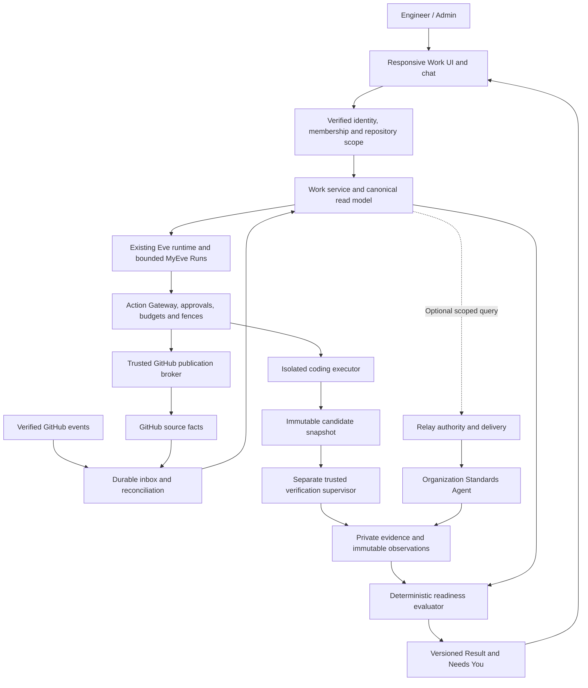
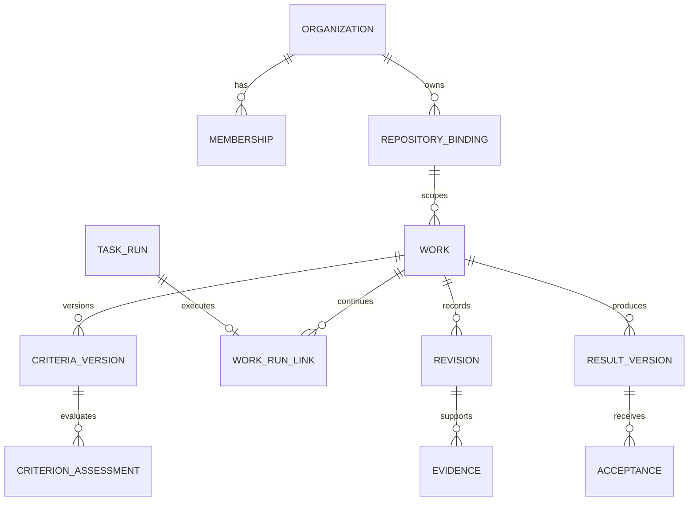
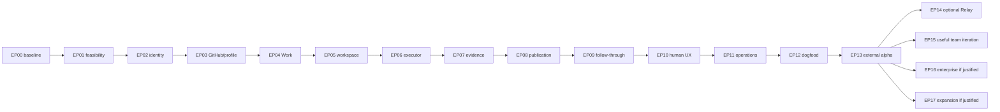

# MyEve Engineering — implementation plan

The user authorized implementation and end-to-end/UI testing on 2026-09-25, including Sofie ↔ Atlas information exchange. Work proceeds in an isolated `codex/engineering-pilot` worktree. Conditional future expansion remains gated by pilot evidence; this authorization does not claim production release qualification.

**Product promise:** Delegate bounded engineering work and receive a review package with current evidence, without having to supervise every handoff.

**Recommended first product:** one organization-scoped engineering Agent, GitHub, one qualified coding executor, isolated cloud execution, a durable Work lifecycle, exact-action approvals, and evidence-backed readiness. Include bounded CI and review follow-up in the alpha: follow-through is the hypothesis being tested. Keep merge, deployment, production access, arbitrary integrations, and automatic executor switching out of scope.

**Important distinction:** this plan defines how to establish end-to-end correctness. It does not claim the proposed product already works. Acceptance scenarios in the companion verification matrix must pass on a pinned implementation and deployment before release.

## Reading guide

- [Claude review and recommendation reconciliation](2026-09-25-myeve-engineering-claude-review.md): what to retain, correct, promote, and defer.
- [End-to-end verification matrix](2026-09-25-myeve-engineering-verification.md): observable release tests, failures, and evidence requirements.
- [Source coverage ledger](2026-09-25-myeve-engineering-source-ledger.md): all 916 numbered recommendations, source hashes, continuation handling, and implementation workstream routing.
- This document: current-state inventory, decisions, scope, architecture, UX, phased work packages, migration, operations, and pilot evaluation.

## 1. Evidence boundary and current source

Source inspection on 2026-09-25:

| Repository | Inspected path and revision | Qualification boundary |
|---|---|---|
| MyEve | `/Users/jaywest/Myeve`, branch `main`, `67550453ce1c87dd20631ca6664ee78fad5f4e3e` | Working tree has existing edits to README, Composio connection, Computer instructions, and executor inventory. Those edits are not incorporated or overwritten by this planning task. |
| Relay | `/Users/jaywest/Documents/ChatGPT/New project/relay-protocol-canonical`, detached HEAD `381918e5ce6a24ecdf5ba5d74daec02663728662` | Clean at inspection. Detached checkout is not a recommended implementation destination. |

The earlier conversation inspected older revisions. **The old MyEve/Relay signature mismatch is no longer a current source blocker:** MyEve now parses and verifies `relay-federation-v2`, including exact key-version and canonical-byte checks. This inspection does not replace live interoperability qualification of a selected pair.

MyEve now uses Eve **0.66.3**, Next **16.3.5**, and an AI SDK dependency of **^7.0.114**. Installed Eve documentation includes durable sessions, tenant authentication patterns, and a GitHub channel. There is no configured GitHub channel in `apps/eve/agent/channels/` at this checkpoint. Framework availability is reusable capability, not a shipped MyEve engineering workflow.

MyEve migrations extend through **0035**. Preserve 0034 multi-Run history and 0035 peer permissions, plus the historical-lineage bridge. Do not allocate a migration number until implementation starts and the current manifest is rechecked.

The routine release constant remains disabled. Relay private-preview mode still denies runtime actions. Both repositories contain historical reports with differing qualification scopes and signing lineages. Read report introductions and supersession notes; never combine passing numbers from different commits into one release claim. MyEve and Relay both retain automatic-deployment restrictions. No hosted status or secret configuration was inspected here.

No `docs/solutions/` collection was found. Relevant institutional lessons came from migration reconciliation, conversation-Run architecture, Computer resource lifecycle, and federation qualification documents instead. Full application tests were not rerun for this documentation task.

## 2. Review verdict and changes to Claude's proposal

The supplied material is a comprehensive product recommendation catalogue, not an executable dependency plan. The ideas are largely aligned with the codebase, but repeated numbering is not implementation progress. Consolidate them into the work packages below.

Retain these principles:

1. Work persists across Runs, executors, browser sessions, and temporary compute.
2. Models propose actions; deterministic services enforce authority.
3. Readiness requires admissible evidence; prose cannot set readiness.
4. GitHub owns code, PR, review, and check facts. MyEve owns delegated responsibility and its read model.
5. Organization data stays organization-scoped, including derived memory and summaries.
6. Human supervision is part of the cost of accepted work.
7. Relay grants do not override MyEve's local execution controls.

Corrections that materially affect implementation:

- Replace unconditional “exactly once” claims with durable operation identity, duplicate suppression, fencing, and reconciliation. Some uncertain remote outcomes remain unresolved; safety requires waiting rather than blind replay.
- Move minimal repository profiles, Definition of Done, budgets, provider health, and CI/review continuation into alpha prerequisites. Their advanced editors and analytics can wait.
- Separate deterministic evidence admissibility from semantic correctness. An authorized verifier can prove what ran against which revision; it cannot prove every natural-language criterion merely by seeing a green test suite.
- Protect the verification producer and its configuration from candidate code. Signed output from a compromised runner is still untrustworthy.
- Distinguish READY_FOR_REVIEW from human ACCEPTED and GitHub MERGED. Do not require final human review before offering work for that review.
- Introduce STOPPING, CANCELLED, manual-control, and external-state-unknown semantics. A green Stop toast must not hide running compute or in-flight writes.
- Treat branch push as a consequential action that may trigger CI, secret use, or deployment. “No deploy tool” alone does not establish “no production mutation.”
- Do not turn the existing owner ID into a shared employee identity. Organizational ownership, human actor identity, membership, and repository authorization are separate facts.
- Use plain relational evidence records and links; no graph database, universal workflow engine, or marketplace in alpha.
- Preserve qualified local controls. Add scoped engineering adapters; do not unlock blocked Composio/MCP or global routines to obtain GitHub access.

## 3. Decisions to record before dependent implementation

These are recommendations for review, not silently accepted product decisions. Unaffected design, fixture preparation, and documentation may proceed while they remain open. Implementation work packages name their decision dependencies.

| ID | Decision and recommended default | Alternative and tradeoff | Needed before |
|---|---|---|---|
| D1 | Prioritize a bounded engineering pilot as a new edition, sharing MyEve source. | Continue the personal-agent roadmap first; less market change, slower engineering validation. The current roadmap explicitly defers multi-owner tenancy. | EP00; formally revise roadmap only after owner decision. |
| D2 | Managed hosted alpha, initially one isolated deployment/database/blob namespace per organization, with individual member authentication. MyEve operates it. | Shared multitenant deployment lowers operational cost but widens the initial isolation audit. Owner-managed Builder deployment remains a separate personal-product path. | EP01 and EP02. |
| D3 | Organization-scoped Agent identity for business pilots, with no personal workspace enabled. | One cross-life Agent requires a larger retrieval, memory, offboarding, and sharing boundary. | EP02. |
| D4 | First executor qualification candidate: headless Claude Code in the controlled sandbox; pin executable/config and use a typed adapter. | Evaluate Codex or another headless executor against the same fixture if the candidate fails. No automatic failover; no claim another provider is integrated. | EP01 and EP06. |
| D5 | Business identity via a selected managed OIDC provider; Admin and Engineer roles; explicit member-to-repository grants. | GitHub identity may reduce onboarding but requires proof of organizational membership and lifecycle behavior; shared password is unacceptable. Exact identity vendor remains to be selected. | EP02. |
| D6 | Pilot GitHub App controlled by MyEve, selected repositories, brokered writes, explicit draft-PR approval; narrow ongoing branch-write grant established during assignment. | Vercel Connect-managed App could reduce credential operations if exact installation/resource binding and publication control are proven. | EP03. |
| D7 | Initial work types: bounded bug fixes and small maintenance changes in selected nonproduction-sensitive areas. | Imported existing PR follow-up is the next template, not a second unrelated product. Auth, infra, migrations, deployment workflows and production remediation excluded from first external cases. | EP01 and EP12. |
| D8 | Provider data handling, allowed model, region, retention, pilot spend ceilings, and operating owner must be recorded for each partner. | No implicit use of personal subscriptions, customer credentials, or sample dollar amounts. | Any paid/live qualification; external alpha. |
| D9 | Relay optional for local-context work; one Standards Agent later with a separate release gate. | Making Relay mandatory would block the core experiment on unrelated platform qualification. | EP14. |

No honest reuse percentage or calendar promise can be inferred from files alone. This is substantial integration and security-boundary work using existing infrastructure, not a copy-only repositioning. Relative work estimates appear below; EP01 supplies measured estimates.

## 4. Current-state gap analysis

Classification: **REUSE** means a source primitive exists; **ADAPT** means extension/integration is needed; **GAP** means no product-complete path was found in the inspected surfaces; **DEFER** means outside this release. None is a fresh production qualification claim.

| Area | State | Existing anchors | Required engineering change |
|---|---|---|---|
| Durable conversation/runtime | REUSE/ADAPT | `agent/agent.ts`; installed Eve durability docs; `docs/qualification/eve-0.66.3.md` | Work must outlive a particular Eve session; qualify session deployment handoff and worker loss. |
| Goals/plans/tasks | REUSE | `lib/goals.ts`, `lib/goal-types.ts` | Optional Work links; no mandatory Goal setup. |
| Runs and accounting | ADAPT | `lib/task-runs.ts`, `lib/task-types.ts`; `migrations/0034_conversation_runs.sql` | Add Work linkage and explicit engineering Run start/resume authorization. Do not use chat renewal to revive delegated authority. |
| Results/outcomes | ADAPT | `lib/control-center.ts`, `lib/outcomes.ts`, `lib/outcome-types.ts`, `/results` | Immutable revision-specific review package and distinct owner feedback. |
| Knowledge/provenance | ADAPT | `lib/knowledge.ts`, `lib/knowledge-types.ts` | Scoped repository context, reviewed promotion, freshness, organizational storage. |
| Memory | ADAPT | `agent/lib/memory-store.ts`, `lib/owner-knowledge.ts` | Prevent corporate context entering personal or provider-global namespaces. |
| Action Gateway/approvals | REUSE/ADAPT | `lib/action-gateway.ts`, `lib/action-adapters.ts`, `lib/approvals.ts` | Concrete GitHub target resolvers, actor membership, repository ceiling, execution fence, receipts. |
| Recovery | REUSE/ADAPT | `lib/action-recovery.ts`, `lib/execution-store.ts` | Engineering operation reconciliation and independent resource cleanup. |
| Routines | DEFER activation | `lib/routine-release.ts`, `lib/routine-admission.ts` | Keep gate closed. Event-driven Work continuation uses its own explicit bounded authorization, not a fake routine. |
| Computer lifecycle | REUSE/ADAPT | `lib/computer-resource-store.ts`, `lib/computer-resource-provider.ts`, `lib/computer-resource-recovery.ts`, `lib/computer-template-lifecycle.ts` | Qualify repository execution class, images, commands, isolation, and cleanup; do not broaden interactive browser authority. |
| Repository execution workspace | GAP | Existing sandbox/resource ownership primitives | Safe checkout, pinned base, single writer, protected verifier, snapshots/patch custody, rehydration. |
| Coding executor integration | GAP | Eve runtime and tools; no qualified dedicated engineering executor located | One headless adapter; stop/follow-up/cost capability qualification. |
| GitHub lifecycle | GAP/available framework building block | Installed `eve/docs/channels/github.mdx`; Composio path blocked by qualification boundary | Install mapping, authenticated intake, Git facts, brokered writes, durable events, CI/review reconciliation. |
| Work aggregate | GAP | Run-based Control Center and existing Goals | Thin durable Work identity/versions/links; canonical read model. |
| Evidence and readiness | ADAPT/GAP | Checks, task artifacts, private Blob, outcomes | Typed verifier identity, exact commit/environment/profile bindings, immutable observations, deterministic evaluator. |
| Organization/member identity | GAP | Current `web-auth.ts`, `owner-identity.ts` are deployment-owner-oriented | Individual login, membership, access scope, role check, revoke, scoped agents and content. |
| UI | ADAPT | Chat, Control Center, Results, Manage, Knowledge, Goals | Work-first navigation; reusable Needs You queue; responsive review package. |
| Skills | REUSE/ADAPT | Skill assignments/catalog/evals and routing checks | Versioned engineering instructions with bounded tool manifests; no new skill marketplace. |
| Files/export/restore | ADAPT | `lib/owner-data.ts`, `lib/owner-data-domains.ts`, private artifacts | Add new domains; restore content as paused/non-executable; preserve non-restorable authority rule. |
| Federation signatures/relationships | REUSE/qualify | `lib/relay/transport.ts`, `peer-permissions.ts`, `inbox.ts`, `projection.ts`; 0035 | Current V2 support exists. Qualify exact paired releases and scoped Standards query. |
| Relay authority/protocol | REUSE/qualify | Relay `lib/v2/federation/{service,transport,registry}.ts`; `/api/v2/federation` | Maintain double authorization; no new universal protocol for alpha. |
| Builder | REUSE/ADAPT | `apps/builder/lib/{assemble,manifest,primary-bootstrap}.ts` | Preserve personal deployments; feature-pruning and generated build checks for any edition additions. |
| Operations/evaluation | ADAPT | Existing health, telemetry, runbooks, unit/SQL/browser qualification | Work-specific alerts, operator recovery, paired pilot metrics and safe content boundaries. |

The installed GitHub channel can dispatch turns and post replies. Those defaults are not permission to enable it unchanged: automatic comments, sandbox checkout credentials, comment-derived identity, and all write paths require the same engineering authorization contract.

## 5. Release scope and end-to-end experience

### R0 — internal engineering dogfood

One operator, a synthetic/private test repository, no customer data. Complete the same Work lifecycle intended for alpha. Include one changed requirement, one CI failure, a later review request, a process restart, and explicit human takeover. Read-only investigation and local patch production are earlier milestones, not proof that the full loop works.

### R1 — managed design-partner alpha

Organization-only accounts, individually authenticated Admins/Engineers, selected repository grants, a reviewed repository profile, one executor, one sandbox provider, bounded issue intake, criteria versions, verification, draft PR, safe CI/review follow-up, Needs You, acceptance, kill controls, support, export and cleanup. Responsive web is the product surface. Start with one team; expand to 3–5 partners only after operational capacity and initial results justify it. “5–20 engineers per partner” is a ceiling to test, not launch staffing assumed.

### R2 — useful team iteration and optional specialist

Add Work-derived Daily Brief, richer templates and history, reviewed repository Knowledge, imported PR-follow-up template, and one Relay Standards Agent. Local work continues during Relay outages only when no mandatory input depends on Relay. General Relay work delegation is not required for the first query-only specialist.

### R3 — enterprise and broader interoperability

Only after repeat usage: shared multitenant hosting if justified, broader repository ACLs and teams, SSO/SCIM enterprise integrations, policy packs, audit export controls, controlled upgrades, additional qualified executors, independent specialist verification, and developer integration contracts. Desktop requires evidence of valuable blocked local/VPN workflows. Native mobile requires evidence responsive web is inadequate.

### Not part of R1

Auto-merge, deployment, production mutation, organization-wide repository access, autonomous incident response, arbitrary MCP mutation, cross-company agent work, marketplace/directory, agent reputation, complex workflow designer, graph database, self-modifying policies, automatic executor failover, customer-cloud execution, native apps, payments, phone, and unrelated lifestyle features. Hide consumer navigation in the edition; do not delete working personal functionality.

### Golden workflow and gap classification

| Step | User/system behavior | Gap | Human involvement |
|---|---|---|---|
| 1 | Admin creates organization; member signs in; selected repo granted | GAP | Necessary authority |
| 2 | Engineer assigns a bounded GitHub issue through web/chat | GAP | Necessary intent |
| 3 | Persist Work, source snapshot, objective and request dedupe key | GAP | None |
| 4 | Propose criteria with source attribution; confirm material inferred criteria | ADAPT | Judgment only when ambiguous |
| 5 | Admission checks scope, profile, capacity, budget and provider readiness | ADAPT | Setup exception only |
| 6 | Recheck actor/repo authority and issue state; create bounded Run | ADAPT | None within approved contract |
| 7 | Prepare isolated checkout at exact base; validate environment | GAP | Environment exception only |
| 8 | Assemble bounded authorized context; preserve assumptions | ADAPT | None |
| 9 | Establish plan and verification requirements | ADAPT | Material scope/risk decisions |
| 10 | Start pinned executor under current Run/Work limits | GAP | None |
| 11 | Executor edits isolated repository without publish credentials | GAP | None |
| 12 | Capture immutable candidate commit/tree and changed-file inventory | GAP | None |
| 13 | Trusted supervisor runs required verification in fresh sandbox | GAP | None |
| 14 | Persist observations and criterion assessments for exact inputs | ADAPT | Semantic assessment where required |
| 15 | Evaluate candidate eligibility for publication, not final PR readiness | GAP | None |
| 16 | Preview exact draft PR publication; approve; broker publishes | GAP | Necessary authority unless explicit policy allows |
| 17 | Observe CI using signed events plus bounded reconciliation | GAP | None |
| 18 | CI failure creates one authorized bounded continuation | GAP | New scope/budget only |
| 19 | Review request arrives and correlates to Work/review revision | GAP | Reviewer's actual judgment |
| 20 | Apply authorized feedback; ambiguous/security scope goes to Needs You | GAP | Judgment when needed |
| 21 | Candidate changes invalidate prior evidence; rerun required checks | GAP | None |
| 22 | Fresh external read + evaluator establishes current readiness | GAP | None |
| 23 | Publish immutable Result version and one transition notification | ADAPT | None |
| 24 | Human reviews, accepts, returns, takes over, or closes Work | ADAPT | Necessary final judgment |

No prerequisite requires every Work to have a Goal, another Agent, or a new chat. Chat and UI invoke identical domain services.

## 6. Architecture and responsibility

Keep the Next.js app, existing Eve runtime, PostgreSQL, Blob storage, and qualified resource-lifecycle foundations. Do not add Temporal, Kafka, a second agent framework, or full event sourcing for this edition. Relay's own infrastructure choices are not MyEve requirements.

**Durable wake-up:** a transaction persists event receipt, domain change and an outbox entry. A supervised publisher delivers a deduplicated wake-up into the existing runtime. Lost acknowledgement causes redelivery with the same identity. A scheduled reconciliation sweep discovers missed events and abandoned attempts. Do not perform the entire Work inside an HTTP handler or treat an unawaited promise as durable execution. EP01 must prove the selected deployed runtime handles the worker/sandbox/session topology and replay boundaries. Existing routine claims are patterns to reuse, not tables to repurpose as unrelated Work occurrences.

| Fact | Authority |
|---|---|
| User identity / membership | Selected identity provider plus current MyEve membership records |
| Corporate ownership | Organization scope; separate from human assignee |
| GitHub installation and repository selection | Current verified App installation plus local admin narrowing |
| Issue/branch/PR/check/review state | GitHub, cached with observed time, provider ID and revision |
| Work intent, criteria, ownership and handoff | MyEve Work service |
| Execution deadline, budget and attempt | Existing Run service with engineering admission |
| Action authority and exact approval | Action Gateway and its persisted approval/attempt records |
| Verification execution facts | Qualified supervisor/provider observation |
| Criterion assessment | Admissible evidence plus explicit allowed assessor; semantic uncertainty remains visible |
| Ready for review | Deterministic evaluator over current facts; never a model tool setting |
| Human acceptance | Authorized user's recorded decision on a Result version |
| Peer authority/delivery | Relay; MyEve still narrows local use |

Do not move MyEve Goals or local engineering execution into Relay. Do not duplicate Relay grant issuance inside MyEve. Peer permission UX already exists; extend it only where needed.

## 7. Minimal domain and persistence design

**Recommendation: a thin new durable Work aggregate linked to existing primitives.** A pure projection over Runs cannot preserve responsibility when no Run is active, criteria change, an employee leaves, or an executor is replaced. A new general task engine is unnecessary. Keep Work-owned intent/version/lifecycle facts, derive presentation state, and use existing Goals, Runs, Actions, artifacts and Knowledge.

Proposed schemas below are design contracts, not exact migrations. EP02 resolves compatibility after a full ownership call-site audit.

| Record | Minimum fields and constraints |
|---|---|
| Organization scope and membership | Organization ID; stable issuer/subject user identity; role; active/revoked state; version. Last-admin protection; explicit member-to-repository grant. Separate data owner scope from acting human. |
| Repository binding/profile | Provider repository numeric ID, installation ID, org scope, default ref, selected member grants, profile revision/hash, approved commands/checks, environment image digest, risk paths, no-deploy CI qualification, policy revision. Repository rename must not alter identity. |
| Work | Durable ID, org/scope, human assignee, coordinating Agent, repo ID, source ID/version/hash, objective, lifecycle, generation, mode, criteria version, policy snapshot, branch binding, optional Goal/Task links, bounded budget/iteration/deadline contract. |
| Criteria version and items | Immutable version; stable criterion IDs; statement; provenance; inferred/confirmed state; required evidence/assessment method. Changed requirements create a new version. |
| Work-Run links | Work + existing Run + purpose + input version + sequence. Unique active writer/continuation constraints. A Run belongs to one Work when linked. |
| Revision | Repo, base SHA, candidate SHA/tree, parent, changed files, producer attempt, archive/patch hash if not published. Never use a floating branch name as evidence identity. |
| Executor attempt | Work/Run IDs, provider/version/config hash, idempotent dispatch key, provider session/process identity, lease/fence, status, heartbeat, completion cursor, resume capability, usage provenance. |
| Evidence observation | Work/revision/criteria/profile/policy/environment, producer identity, command argv hash, start/end/exit code, provider check identity/attempt, outcome, artifact digest/bytes, provenance class, observed time. Immutable; raw output private. |
| Criterion assessment | Criterion version + evidence refs + assessor/method + supported/unsupported/unknown/waived disposition; an LLM suggestion cannot upgrade itself to verified. |
| Readiness evaluation | Input-version fingerprint, evaluator version, gate results/reasons, observation freshness, exception refs. Cache with CAS; stale cache never authorizes publication. |
| Result version / acceptance | Immutable evidence manifest, candidate and criteria versions, limitations, cost coverage, created time; acceptance binds exact Result version. New work creates a new version. |
| Attention/decision/exception | Kind, exact subject/version, permitted actor, options, expiry, state, reason, decision metadata. Reuse existing approvals for effects; do not make a second approval system. |
| Provider inbox / Work outbox | Unique provider installation + delivery ID; payload digest; verified source; bounded payload retention; status/attempts; Work correlation; idempotent wake-up identity. |
| Event and external resource links | Append-only material transitions; source event/Action/Run refs; PR IDs and branch bindings. Extend the Action ledger for remote effects rather than creating an independent competing effect ledger. |
| Budget reservations | Atomic Work/org reservation per attempt or billed stage; ledger identity; estimate/observed/reconciled/unknown distinction; release unused funds only after outcome reconciliation. Reuse existing accounting where sound. |

Every tenant-owned lookup, unique index, foreign-key association, artifact request, stream, webhook correlation and job must verify the organization scope. Use composite scoped keys where needed; globally unique IDs are not an authorization mechanism. Denormalized Work IDs on existing records require same-scope FK/validation, not just a string column.

### Organization migration strategy

Do not reclassify existing personal rows as corporate. Personal edition remains a single-owner mode. Engineering starts with a fresh organization scope and disabled personal memory/features.

The preferred compatibility design introduces an explicit data-owner scope abstraction and a separate verified actor principal. A legacy `owner_id` can continue referencing its personal scope during an additive migration, but services must not confuse that scope ID with the actor allowed to approve. If retaining a column name would cause unsafe implicit authority, add explicit scope columns and a reviewed mapping rather than invent an organization-shaped user. Full route/tool/store audit in EP02 decides the least invasive correct implementation.

Dedicated organization deployments reduce cross-customer blast radius; they do not remove the need for user membership, repository access checks, or cross-deployment credential isolation. No shared owner password for business members. All enabled company content paths—including chat, search, files, backup, memory and Relay—must use the business scope; incomplete paths remain disabled for that edition.

## 8. State, readiness and human control

Keep independent facts instead of one overloaded state enum:

- Lifecycle: `ACTIVE`, `ACCEPTED`, `CANCELLED`, `FAILED`, `SUPERSEDED`.
- Control: `AGENT`, `HUMAN`, `PAUSED`, `STOPPING` plus a monotonically increasing generation.
- Presentation: `QUEUED`, `WORKING`, `WAITING`, `NEEDS_YOU`, `READY_FOR_REVIEW`, `DONE`, `FAILED`, `CANCELLED`. Paused/manual/stopping appears explicitly as a control badge and reason.
- External PR state, Run state, readiness and cleanup state remain separate authoritative facts.

Read-model precedence: stopping/authority uncertainty blocks executable controls; unresolved required human decision or unknown external effect produces Needs You; current active attempt produces Working; unresolved mandatory dependency produces Waiting; readiness pass produces Ready for Review; otherwise queued/blocked with a concrete reason. A failed latest attempt does not terminally fail Work when a bounded recovery exists. Archive is visibility only.

`READY_FOR_REVIEW` requires all of:

1. Current Work is active, no manual hold, no unclosed consequential attempt, no unresolved required human decision, no mandatory blocker.
2. Current criteria and approved verification profile exist; each required criterion has the permitted assessment/evidence or an explicit permitted exception.
3. Required checks are current for the exact candidate, correct trusted producer/check identity and environment; unknown, missing, cancelled, timed-out or skipped checks do not default to pass.
4. For draft-PR mode, correct open PR, expected repository/base/head, current mergeability/base-policy assessment and required CI observations. Investigation/patch modes use their own result contract and do not falsely advertise PR readiness.
5. Current authority has not been revoked and external observations are within the freshness window. Historical evidence can still be inspected after revocation without authorizing further work.
6. A final provider refresh and CAS confirm no known change between evaluation and publication of the Result. Store `observedAt` and input fingerprint. GitHub can change immediately afterward; later events invalidate the current badge, not rewrite the historical Result.

**Two gates avoid a deadlock:** local candidate eligibility permits asking to publish a draft PR. Final review readiness requires the resulting PR and CI. Do not demand a PR before allowing its creation.

MyEve's Ready for Review badge does not automatically change GitHub's draft flag or request reviewers. In alpha, the human can mark the PR ready in GitHub when team review is appropriate; MyEve observes that transition and may continue its already-authorized branch work. GitHub draft PRs are not mergeable and do not automatically request code-owner review. The repository CI qualification must cover the later human-driven ready-for-review transition too. [GitHub PR stages](https://docs.github.com/en/pull-requests/reference/pull-requests). Automatic promotion/reviewer requests would be a separately approved Action, outside the initial write surface.

Exceptions have exact Work/criterion/revision/policy scope, named authorized actor, reason, expiry and nonwaivable categories. Missing identity, revoked authority, cross-scope access, forged evidence, unknown consequential effects, and forbidden merge/deploy cannot be waived. Optional verification absence is a limitation; a required verification waiver produces an unmistakable “Ready with approved exception” label, never an unqualified pass.

Human acceptance marks one immutable Result as accepted; it is not a merge instruction. External merge/close is reconciled independently. A merge of an unreviewed changed head is not evidence the earlier Result was accepted. Requirement expansion creates new criteria, re-admission, and possibly separate linked Work, never a silent budget or authority increase.

Minimum lifecycle transition contract:

| From → to | Guard and durable consequence |
|---|---|
| New → ACTIVE | Valid scoped intake; execution still requires admission. A queued Work need not own a running process. |
| ACTIVE → ACCEPTED | Authorized human accepts a current Result; stop future automatic continuation and retain any external cleanup obligation. |
| ACTIVE → CANCELLED | Authorized cancellation fences further work immediately; display STOPPING/unknown effects until termination and reconciliation complete. Cancellation never deletes history. |
| ACTIVE → FAILED | Recovery contract exhausted or explicitly ended; record reason and current candidate custody. A single failed attempt alone is insufficient. |
| ACTIVE → SUPERSEDED | Authorized replacement links successor Work, preserves source/history and fences the predecessor. |
| ACCEPTED/FAILED/CANCELLED → ACTIVE | Explicit authorized reopen, fresh generation and admission; historical Results/acceptances remain immutable. Provider events alone cannot reopen. |
| SUPERSEDED → execution | Not automatic; work proceeds through the explicit successor or a separately authorized new Work. |

Pause, wait, takeover and ready are not terminal lifecycle transitions. Required cleanup/reconciliation continues even for terminal Work, without permission to restart productive execution.

### Pause, stop and takeover

Stop first revokes new action admission and advances the Work fence transactionally. Request executor termination, revoke broker access, stop compute, and independently verify cleanup. Display STOPPING until confirmed; uncertain in-flight writes remain in reconciliation. Do not promise retroactive cancellation of an already accepted remote request.

Pause preserves checkpoint and stops further execution; waiting normally releases compute. Takeover cannot hand out exclusive writer control until prior writer is quiesced or its inability to publish is established. Give Back re-fetches branch, checks changes/criteria/policy, stales old evidence, and creates fresh bounded Run authority. If prior run expired, old approval stays historical; new exact action/approval is required. The existing same-Action continuation remains valid only while all original bindings and parent authority remain valid.

## 9. GitHub integration and publication safety

Prefer a cohesive domain adapter over exposing arbitrary GitHub tools. Initial operations: read issue/repository/base/checks/reviews, capture bounded source, create/update a dedicated Work branch, create a draft PR, read back effects, observe events and reconcile. No merge, tag/release creation, workflow edit, repo deletion, secret/admin mutation, or arbitrary HTTP passthrough.

GitHub App tokens can be narrowed to selected repositories and permissions and expire after an hour; default issuance can be broader than a single repository. Explicit narrowing is mandatory. Treat token strings as opaque. [GitHub installation token API](https://docs.github.com/en/rest/apps/apps#create-an-installation-access-token-for-an-app).

Suggested initial permission review: Metadata read; Contents read for intake and broker-only write for publishing; Issues read; Pull Requests read/write for the broker; Checks read; Actions read when workflow logs/status are required. Verify endpoint-specific requirements during EP03; these are proposed permissions, not a guaranteed exhaustive manifest. No write token in executor, model context, customer code environment, logs or generated git remote. App permissions alone are not branch-level or operation-level restrictions.

**Approval versus ongoing authority:** initial draft-PR publication uses an exact-action approval. An explicitly approved Work policy may separately permit bounded subsequent updates to its dedicated branch. Each update is a new exact Action with fresh admission against that current grant, candidate, limits and repository policy; it does not reuse the original PR approval. Scope/path/risk expansion requires a new decision. If the existing Gateway cannot represent this safely, require a new exact approval per update and report the extra supervision cost until the bounded-grant path is qualified.

**Trusted publication path:** control-plane fetch helper obtains bounded source at known revision; executor receives source without credentials. Executor returns candidate object/patch references. A separate trusted publisher validates repository binding, allowed branch prefix/identity, parent/base, changed paths, secret scan and exact payload approval, then writes using current authority. Reject hooks, credential helpers, unsafe filters, unexpected submodules/LFS fetching, path traversal, symlink escapes, oversized archives and arbitrary remote URLs. Untrusted candidate scripts never run inside the publisher.

Writes serialize per Work branch. Initial branch creation claims an unambiguous namespace. Subsequent updates must have a qualified expected-head/CAS or tested equivalent fencing contract. A pre-read followed by an unconditional push is insufficient. Do not force-push over human commits. If GitHub/protocol behavior cannot provide the claimed writer guarantee, narrow to fresh immutable branches and stop for handoff instead of pretending a local lease locks GitHub.

**CI is an execution boundary.** Before permitting any push, review repository workflow triggers, reusable actions, checkout refs, workflow-file changes, token permissions, secrets, OIDC, self-hosted runners and auto-deployment behavior. A same-repository PR can run attacker-controlled candidate code even without changing a workflow file. Require a qualified safe CI lane with no production authority, or use patch-only mode. Block privileged `pull_request_target`/`workflow_run` patterns that execute candidate code. Restricting model tools does not control GitHub's separate automation. [GitHub Actions secure use](https://docs.github.com/en/actions/reference/security/secure-use).

Webhooks verify original body signatures before parsing/processing. Map installation + repository identity to current organization; payload actor identity is not automatic MyEve authority. Durable intake precedes acknowledgement. Deduplicate by provider delivery identity; retain payload hash to detect identity conflicts. [GitHub webhook validation](https://docs.github.com/en/webhooks/using-webhooks/validating-webhook-deliveries).

GitHub does not automatically redeliver failed webhook deliveries. Implement a bounded failed-delivery recovery job and periodic canonical reconciliation for active Work, with pagination, backoff, ETags where supported and rate-limit handling. Events are hints to re-read current facts; a delayed prior check must not overwrite a newer attempt. [Failed webhook delivery handling](https://docs.github.com/en/webhooks/using-webhooks/handling-failed-webhook-deliveries).

An uncertain PR create/push never triggers blind retry. Record Action identity before dispatch; reconcile exact installation/repo/head/base/provider receipt and stable correlation. Missing results in an eventually consistent list are not proof of nonexecution. Ambiguity produces a durable unresolved state with safe operator/human choices. Notifications and optional comments have their own delivery state and cannot restart completed work.

## 10. Executor and engineering workspace

EP01 selects the smallest qualified adapter. Recommendation: evaluate **Claude Code headless** first because its documented CLI offers structured output and bounded process control, without requiring MyEve to invent a coding agent. This is a new integration, not reuse of an existing qualified MyEve executor. The TypeScript SDK reference fetch was unavailable during research; do not invent SDK-specific signatures. CLI or SDK choice is finalized against the pinned version during the spike.

Current official documentation describes `-p`, JSON/stream output, explicit resume, and bare mode to suppress automatic repository/host configuration. Without that isolation, headless startup can load project hooks and MCP configuration. Use a clean runtime home and an explicit allowed configuration; verify pinned behavior before activation. Cost output is an estimate and resumed sessions may report cumulative totals; avoid double counting. Process termination is not a completed result. [Claude programmatic execution](https://code.claude.com/docs/en/headless), [CLI reference](https://code.claude.com/docs/en/cli-reference).

Minimal internal adapter: `start`, `observe`, `followUp`, `requestStop`, `collectCandidate`, `collectUsage`. Expose explicit support values for resume, verified stop, structured progress, native budget enforcement and usage reporting. `unsupported` is valid; synthetic provider parity is not. Work survives even when executor session resume is unavailable: launch a new attempt with current bounded context and preserved revision.

Run the executable inside a Work-scoped sandbox, not the web server or developer's Mac. Separate control-plane credentials and immutable supervisor configuration from writable source. Installed Vercel Sandbox network controls are a useful foundation, but their qualification is specific to provider/version and environment. Domain/CIDR allowlists do not prevent exfiltration to an attacker-controlled resource on an allowed domain. [Vercel egress controls](https://vercel.com/changelog/advanced-egress-firewall-filtering-for-vercel-sandbox).

Repository profile includes image digest, runtime/package manager, locked dependency installation, allowed package sources, service fixtures, resources, approved verification commands and timeout, changed-path restrictions, required CI identities and retention. No public-network side effects are authorized merely because the command is `npm test`.

Qualification must prove: process-tree stop, network policy, DNS/private-address restrictions, stdout bounds, resource deadlines, fresh home, absence of developer credentials, cache isolation, no host mounts/control socket, no cross-Work read, safe package install, actual provider cleanup, and reconstructable checkpoint. Candidate tools cannot call broker mutation endpoints. Model credentials should be held by a scoped request broker or provider-supported credential mechanism; a broad model account key must not be exposed to arbitrary repository code. Exact implementation is an EP01 gate, not an assumed SDK feature.

Lifecycle: admitted → preparing → ready → active → checkpointing → quiescing → cleanup_pending → verified_cleaned. Reuse immutable resource identity, cleanup tombstones, leases and generation fences from current Computer lifecycle where applicable. ComputerSession and EngineeringWorkspace remain distinct execution classes; no blanket increase in browser/terminal authority.

Before releasing compute, persist candidate commit/patch and evidence references atomically enough to prove custody. If upload fails, retain bounded recovery ownership; do not delete the only copy. Waiting for hours of CI/review should not keep a sandbox alive. Rehydration starts fresh from trusted source plus verified candidate, never resumes old credentials or execution handles.

## 11. Evidence and verification design

Use three distinct objects:

1. **Observation:** a qualified producer reports actual execution/check facts.
2. **Assessment:** a criterion is supported, contradicted, unknown or waived based on observations and an identified assessor.
3. **Readiness:** deterministic rule aggregation over those records.

A model can suggest criterion-to-test mappings; it cannot submit an authoritative exit code or grant itself producer identity. Authenticated observer service writes immutable evidence; candidate runtime has no evidence DB credential. Raw logs/artifacts use private storage, size limits, content-type validation, sanitization and authenticated reads. Hashes establish byte identity, not semantic truth.

For alpha, evidence links terminate at an authenticated application route that checks current membership and repository scope before each download. Do not expose reusable public Blob URLs or long-lived bearer download links. Revocation cannot erase a file already downloaded; the enforceable promise is denial of new server retrievals and termination of active streams according to the selected revocation target.

Verification starts in a fresh environment after candidate capture, without the coding agent running and without its writable supervisor configuration. Use administrator-reviewed command definitions, explicit executable/argv/cwd, immutable harness/image, and allowlisted structured report parsers. Candidate changes to test scripts or test selection are surfaced; zero tests, hidden skips, removed assertions, or a rewritten command cannot silently satisfy the original gate. Preserve independent/base holdout checks for selected pilot cases. Testing candidate code remains adversarial execution; even a real exit zero can be a weak criterion proof.

Evidence identity includes repository ID, candidate SHA/tree, base SHA or integration SHA where relevant, criteria version, profile/policy/evaluator versions, environment digest, dependency lock hash, producer identity, command/check identity, attempt ID, outcome, timestamps, output hashes and limits. Distinguish complete output from truncated or unavailable output.

Conservative alpha invalidation: any candidate SHA change stales all required candidate evidence. Criteria/profile/policy/environment changes invalidate affected gates; missing dependency mapping invalidates all rather than infer relevance from prose. Base advancement triggers integration/mergeability verification according to the approved profile. Old observations remain historical. Selective reuse is a later optimization requiring proof.

CI checks bind producer App ID, workflow/check identity and latest attempt, not merely a display name called “tests.” Record whether a check validated head SHA or provider-generated merge SHA; require a verified mapping to current base/head. A signed webhook proves delivery origin, not that a candidate-controlled test established the business requirement.

Baseline comparison is useful but probabilistic classification remains labeled: one failure on both revisions suggests pre-existing/environmental behavior; it is not conclusive proof. Baseline failures do not waive a required gate. Repeated controlled runs or an authorized exception may be needed. Unknown assessment prevents an unconditional readiness claim.

## 12. Budgets, retries and continuation

Bound Work by repository, permitted actions, risk paths, active runtime, total wall deadline, attempts, model steps, maximum continuation count, and cost reservation. Record an explicit pilot policy rather than accepting unspecified infinity. Waiting time and active compute time are separate.

Before each stage, atomically reserve the next bounded allowance against Work and organization limits. Reserve concurrency slots as well as dollars. No parallel attempts can each spend the same remaining balance. Reconcile cumulative versus incremental provider usage by attempt identity. Unknown cost is `unknown`, not zero; reserve conservatively and pause if exposure cannot be bounded.

A provider may bill an in-flight request after a stop decision. State the enforcement boundary and reserve for the maximum admitted request/compute interval. Do not promise an exact monetary hard cap unless the provider contract and request bounds establish it. No new paid stage after exhaustion.

CI/review wake-ups use a durable cause identity (provider check attempt/review ID + observed candidate + Work generation). One winning claim creates one continuation. The current Work contract may authorize a fresh bounded Run; a model, old chat confirmation, or expired approval may not renew it. Permission, membership, source version, budget, resource ownership and current policy are rechecked before every effect.

Automatic repair is allowed only for classified in-scope failures with approved commands and a finite iteration budget. Product decisions, security-sensitive requests, contradictory reviewers, changed requirements, no-progress loops and repeated environmental failures produce Needs You. Review classification is advisory; it cannot silently dismiss a required human change request.

## 13. UX and agent-native operations

Engineering navigation: **Home, Work, Chat, Needs You, Results, Settings**. Goals and Knowledge remain available context views; low-level Runs/Actions/Relay diagnostics sit under Advanced. Reuse Kumo and current visual language.

Home emphasizes changed Work and pending decisions. Work list shows issue/title, repository, actual state/reason, next step and last update. Work detail offers Overview, Changes, Evidence, Activity and Decisions with progressive disclosure; combine tabs if early data does not justify all five. Show exact revision and stale-state banners without requiring users to understand leases.

Needs You cards distinguish clarification, exact approval, permitted exception, exhausted budget and recovery. Show consequence, alternatives, recommendation as recommendation, evidence, allowed actor and expiry. Discuss does not resolve the pending decision. Changed parameters replace the proposal and invalidate previous approval. Double submission and stale browser tabs return the recorded decision or an explicit conflict, not a second effect.

Result shows objective, criteria/assessment, changes, exact revision, required checks, limitations, unresolved risks, evidence, PR, cost coverage and agent/executor attribution. “Accepted” is a user action on an immutable version. Historical accepted Result remains viewable if current Work moves on.

Every surface requires loading, empty, permission-denied, expired-session, provider-error, stale-data, and success states. Preserve draft intake/criteria edits across recoverable errors. Offline clients can read cached safe status with a timestamp, but cannot approve or claim a stop succeeded. Deep links authenticate and enforce membership/repository access; a URL is not a share grant. Keyboard and mobile approval flows must show full consequence without color-only state.

Proposed domain commands, exposed through both UI and agent tools: `create_work`, `get_work`, `list_work`, `propose_criteria`, `get_readiness`, `request_work_pause`, `request_takeover`, `resume_work`, `get_evidence`, `propose_publish`, `record_work_feedback`. Final approvals/admin membership changes remain authenticated human operations; agents can propose them but cannot impersonate the approver. No `set_ready=true` tool.

Proposed HTTP family: `/api/engineering/work`, `/work/:id`, `/criteria`, `/readiness`, `/control`, `/evidence`, `/decisions`, `/feedback`; `/integrations/github/webhook`; `/repositories/:id/profile`. Names are provisional until route inventory. Each mutation uses request identity and expected aggregate version, authorization before data access, CSRF/origin protection for browser cookies, bounded body sizes, rate limits, and auditable results. Streams must terminate or redact upon access revocation.

Notifications: in-app is mandatory and durable. One qualified external channel is optional; send only meaningful state changes. Delivery failure cannot reset Work. Daily Brief reuses the same read model; no separate intelligence pipeline.

## 14. Implementation work packages

IDs below are planning IDs, not canonical numbered repository todos. Allocate unique work-order numbers only after plan approval. Complexity: S = contained adaptation; M = several service/UI boundaries; L = substantial integrated subsystem; XL = cross-cutting security migration. Estimates are relative, not calendar commitments.

### EP00 — baseline, source isolation and decisions · M

Dependencies: D1. Pin clean source for both repositories, identify existing dirty edits without stashing or overwriting them, and create MyEve `codex/engineering-pilot` in a worktree only when implementation is requested. Relay gets a separate worktree only for required changes. Inventory package locks, migration manifest, deployment restrictions, existing tests and source reports. Preserve current personal edition. Record D1–D9 in ADRs; select pilot operator and qualification repositories. Update the canonical roadmap only after scope is approved.

Acceptance: reproducible baseline; existing tests have recorded pass/failure status; no automatic deployment side effect; immutable migrations and unrelated changes preserved. Deliverables: ADRs, inventory, exact SHA manifest, baseline checks. Owner: technical lead/Product Owner.

### EP01 — feasibility and qualification spike · L

Dependencies: EP00, proposed D2/D4/D6. Use synthetic repositories and no customer data. Prove one real sandbox checkout, pinned executor start, structured progress, candidate capture, process-tree stop, credential isolation, independent verifier, safe patch extraction and cleanup. Inspect Eve GitHub channel and Vercel Connect to decide reuse versus concrete App adapter. Prove durable wake-up on deployed runtime after browser/process disconnect. Evaluate Claude headless first; document measured failure before selecting an alternative.

Acceptance: one reproducible controlled candidate; no publish token in sandbox; stop/cleanup observed; usage limitations recorded; estimated capacity/cost and tested API versions; exact required permissions and safe CI lane identified. Failure means reduce to read-only investigation or revisit executor/hosting; do not weaken isolation. This is the principal technical go/no-go before building UI breadth.

### EP02 — organization scope and identity · XL

Dependencies: EP01, D2/D3/D5. Add organization, individual identity, membership, repository access grants, audit actors, session scoping and emergency stop. Design new scope abstraction over owner-scoped stores; cover all enabled content paths, execution services and artifacts. Organization-only Agent bootstrap. Add invite acceptance, expiry/reuse protection, revoke, last-admin guard, support access and per-member checks. Legacy personal login remains separate.

Acceptance: two organizations and two members with differing repository grants cannot cross boundaries through web, tools, streams, jobs, memory, exports, artifacts or Relay. Offboarding blocks new effects, revokes pending decisions and preserves company Work under an admin. Include stale-session and concurrent-revocation cases. Deliver a route/tool/store audit matrix; unconverted endpoints fail closed in engineering edition.

### EP03 — GitHub installation, repository profile and safe intake · L

Dependencies: EP02, D6/D7. Implement App installation/session binding, selected repo listing, current membership/repo checks, token broker, webhook verification/inbox and integration-health read model. Build repository bootstrap as bounded read-only analysis with admin-confirmed profile, required checks, environment and safe CI contract. Intake from authenticated web/chat first; mentions/labels later. Preserve provider numeric IDs.

Acceptance: installation cannot attach to the wrong org; default no repository selected; revoked/missing permissions fail before compute; malicious issue content cannot dispatch unauthorized work; unsafe CI repo remains patch-only. Return truthful setup status and persisted intake identity on retry. No arbitrary connector bypass.

### EP04 — Work aggregate, criteria and basic UX · L

Dependencies: EP02/EP03. Add minimal records from section 7, versioned criteria/provenance, scope/risk admission, Goal/Run links and canonical read model. Reuse existing components for Work list/detail and Needs You. UI/chat domain parity. Make create/revise operations idempotent and version-checked. Ambiguous criteria create a bounded question before starting a paid Run.

Acceptance: Work survives chat reset/reload; concurrent assignments dedupe according to source+request contract; changed criteria invalidate plan/evidence; human manual hold stays until explicit resolution; all loading/empty/error states verified. No model can directly assign authoritative readiness or grant permissions.

### EP05 — engineering workspace and lifecycle · L

Dependencies: EP01/EP03/EP04. Add repository execution resource class with existing immutable ownership, generation, recovery and cleanup foundations. Pinned checkout/image/services/dependencies; per-Work storage and egress; trusted source fetch/publisher separation; candidate/patch custody; cleanup and rehydration. Keep existing Computer behavior unchanged.

Acceptance: no cross-Work or cross-org state; malicious install confined; old cleanup cannot destroy new generation; resource survives upload failure under bounded recovery and is eventually verified absent; review wait consumes no unnecessary live compute. Update executor governance inventory and Builder pruning for new files.

### EP06 — executor adapter and bounded continuation · L

Dependencies: EP04/EP05, D4. Integrate one pinned executor, clean configuration, sanitized progress, attempt leases, start-key dedupe, stage reservations, heartbeat, terminal/unknown status, stop and fresh-context follow-up. Store provider capabilities explicitly. Work→Run authority derives from current contract, never expired chat authority.

Acceptance: crash before/after start, disconnected stream, late completion, unknown cost, stale worker and budget exhaustion produce correct durable states with no duplicate writer. CLI session resume optional; fresh attempt from checkpoint must work. No raw DB/GitHub credentials in executor. Tests include arbitrary repository prompt injection and attempted broker access.

### EP07 — verifier, evidence and readiness · L

Dependencies: EP05/EP06. Implement separate protected verifier, immutable observations, criterion assessment contract, evidence freshness/invalidation, approved exceptions, candidate gate and final readiness evaluator. Bind CI producer/attempt and candidate/base semantics. Raw logs private; result output contains limitations and cost coverage.

Acceptance: forged “PASS,” zero tests, replaced scripts, wrong SHA, stale profile, changed criteria, foreign producer, missing CI and unauthorized waivers cannot yield ready. Human acceptance binds exact Result. Use held-out failures to ensure candidate-written tests cannot define all success conditions.

### EP08 — publication broker and effect recovery · L

Dependencies: EP03/EP06/EP07. Implement exact-target branch/push/draft-PR Action adapters, preview, approvals, publication fence, secret/path scan, provider readback and reconciliation. Issue draft PR only after local candidate gate. Log publishing-stage CI consequences. Optional PR summary is one stable updatable artifact, not per-step noise.

Acceptance: approved payload changes are rejected; no credentials in executor; concurrent human push causes conflict; timeout after PR creation finds existing PR or remains unknown, never blindly creates a second. No merge/deploy/admin operation reachable. Denial produces zero provider writes. Fresh Run does not inherit old approval.

### EP09 — CI, review and external-state continuation · L

Dependencies: EP06/EP07/EP08. Implement verified event mapping, canonical re-read, failed-delivery recovery, deduplicated outbox, finite repair loop, review classification, requirement/head/base drift and issue/PR closed/merged reconciliation. Waiting releases compute. Follow-up reuses same Work with new Run and current inputs.

Acceptance: delayed old CI cannot regress fresh success; duplicate reviews produce one continuation; worker restart retains inbox/wakeup; missing webhooks are found; changed scope goes to Needs You; new SHA stales evidence; current Result reflects the final observed head. Include a CI failure and later human changes request in the golden test.

### EP10 — human handoff, Result and responsive finish · M

Dependencies: EP04/EP07/EP09; UI development may proceed against contracts earlier. Finish Stop/Pause/Takeover/Give Back, stable decision discussion, Result versions, acceptance/return feedback, in-app notifications, current activity and safe deep links. Verify desktop/mobile keyboard and screen-reader critical flow. Expose low-level IDs only in diagnostics.

Acceptance: stale approval page returns conflict; stop remains visibly pending until verified; human can change branch and return without lost history; accepted version cannot be overwritten; revoked member cannot retrieve a prior evidence URL; notification failure does not rerun work.

### EP11 — operations, privacy, migration and release controls · L

Dependencies: all preceding release components; design begins with EP02. Add Work health, stale-attempt/cleanup/outbox alerts, controlled operator recovery, deployment health/readiness, private backups, retention jobs, export domain registration, safe support bundle, restore-as-paused, secret rotation and pilot runbook. Pin behavior versions and qualify upgrade with waiting Work and old pending approvals.

Acceptance: timed restore drill; no authority restored from backup; replay cannot republish an existing PR; old worker is fenced after upgrade; known failures resolved without database edits; costs/resource cleanup reconcile. Personal edition and Builder-generated artifact still build/boot. Exact hosted access/runtime gates pass; no release authorization inferred from source merge.

### EP12 — internal dogfood release gate · M

Dependencies: EP00–EP11. Run golden lifecycle and adversarial/failure matrix on pinned source, schema, providers and environment. Use representative synthetic/approved internal issues. Include an unattended interval, worker death, ambiguous publish result, human takeover, late review and final acceptance. Independent reviewer inspects authority and evidence boundaries; label internal review honestly.

Acceptance: all mandatory verification cases pass; no unresolved critical/high boundary failures, false-ready cases, or unaccounted resources. Publish a dossier with exact versions, logs, limitations, costs and not-run cases. R0 completion is not customer readiness by itself.

### EP13 — design-partner alpha and product evaluation · M plus operating capacity

Dependencies: EP12, named support owner, approved D8/pilot policies. Onboard first organization through product flow, qualify its repo/executor/environment tuple, establish baseline, pre-register pilot thresholds, and run bounded real issues. Start one partner, then increase to 3–5 only if safety and operator load permit. Recheck isolation across separate deployments too.

Acceptance: agreed safety/data terms; restore/stop contacts; sampled evidence accuracy; supervision and accepted-work metrics; weekly review; explicit expand/refine/pivot/stop decision. No marketing claim about time saved without observed comparison. Successful internal dogfood is not demand evidence.

### EP14 — optional Relay Standards Agent · M/L, separate release

Dependencies: core R1 stable, D9, exact paired source qualification, applicable Relay release authorization. Reuse current discovery/peer permissions/query/projection/receipt paths. Admin publishes selected versioned standards; scoped Agent query returns external-context provenance; policy remains local approved configuration. A question cannot request private canonical memory. Material standards changes propose a profile/criteria revision; they never silently rewrite policy.

Acceptance: missing/revoked/expired grant, changed publication, wrong caller, stale signature, duplicate delivery and unavailable peer produce bounded truthful results. Mandatory standards absence blocks readiness; optional absence is a limitation. Pin protocol version and key history; preserve double authorization. Live qualification on actual releases is mandatory; older alternate-signature reports are not interchangeable. Measure added value before further network work.

### EP15 — Work-derived team improvements · M per justified slice

Dependencies: R1 pilot evidence. Daily Brief, better repository templates, prior Work retrieval, reviewed Knowledge promotion, imported PR follow-up, and system-friction analytics. No employee rankings. Roll out each based on observed supervision burden.

Acceptance: metrics show reduced repeated coordination; information stays scoped/current; analytics exclude content by default; no automatic authority learning. Required checks and current source remain authoritative.

### EP16 — enterprise controls · XL across separate approved work orders

Dependencies: repeat team use and a paying/committed customer need. Shared multitenancy decision, SSO/SCIM, teams/policy packs, controlled upgrades, retention options, audit export, budget hierarchies and support access. Qualify migration from dedicated organizations without merging personal data or broadening grants.

Acceptance: identity lifecycle and revocation drills, cross-tenant tests, shared infrastructure isolation, operations/recovery targets, independent security review and explicit cohort release decision. Do not market enterprise readiness from a settings screen.

### EP17 — additional executors, local devices and networks · L/XL per capability

Dependencies: measured user demand and separate design. Add one executor/provider at a time using the same contract suite; qualify handoff and cost semantics. Desktop bridges require device identity, local path scope, command isolation and remote stop proof. Native mobile is optional. Specialist work contracts, external A2A interoperability and cross-company networking require protocol-specific authority/data review. No unbounded feature commitment or date implied.

## 15. Dependency order and release gates

The diagram shows acceptance dependencies, not a requirement to delay all UI/operations design until the preceding package is finished. Contract-bound UI, threat modeling and customer interviews can run alongside backend work. Do not start provider mutations before the relevant authority boundaries exist.

Suggested staffing for estimation: one engineer responsible for identity/authorization and migrations, one for execution/GitHub/evidence, product/design support for Work/Needs You, and independent security/operations review at release. A single engineer can sequence the work but should not promise the same elapsed schedule or independently approve their own security qualification. EP01 should estimate against measured adapter feasibility and available people, including onboarding/support.

Gate A: decisions and feasibility. Gate B: internal complete loop. Gate C: security/recovery/UX and operational release. Gate D: first customer. Gate E: product-value expansion. Gate F: optional Relay. A pass at one gate never implies passes at later gates.

## 16. Migration, rollout and rollback

1. Create implementation worktrees from a pinned, reviewed baseline; preserve existing dirty files. No fork needed unless independent product maintenance is later chosen.
2. Reinventory the migration manifest at implementation time. Never overwrite 0031 lineage variants, 0033 bridge receipts, 0034 Run history, or 0035 peer permissions. New numbers allocated once across concurrent branches.
3. Add engineering schema and feature flags while personal edition remains unchanged. Add same-scope constraints and indexes; backfill links only when ownership is provable. Existing personal rows stay personal.
4. Register export/retention/restore semantics with each new domain. Do not append data domains as an afterthought after schema ships.
5. Qualify fresh DB, current canonical upgrade, each supported historical lineage, failed transaction rollback and rerun. Verify application/worker DB grants, not only migration-owner success.
6. Deploy schema-compatible code with engineering writes disabled. Health/readiness must distinguish unconfigured, unhealthy and unqualified. Test exact built source artifact; a running old engine is not new-code evidence.
7. Enable read-only investigation for selected internal scope. Then patch mode, then brokered publication, then bounded continuation after each gate. Global routine/federation defaults remain unchanged.
8. Before code rollback, pause admissions, fence workers, reconcile active effects and save candidate custody. Restore known compatible application/schema pairing; prefer additive forward fix. Eve 0.66.3 session/workflow handoff has its own constraints—do not promise rollback across incompatible runtime generations.
9. Do not auto-delete PRs/branches to simulate rollback. Preserve external reality and let an authorized human decide disposition. Revoke fresh credentials and verify sandbox cleanup.
10. Backups restore Work/history as paused. Reconnect providers, recheck membership/authority, refresh GitHub facts and reconcile effect IDs before any new execution. Restored approvals, leases, continuation tokens and consumed handles are historical, never live authority.

Deployment flags are proposed edition-scoped gates such as engineering reads, executor start, publish and follow-up, each with organization/repository allowlists. No flag grants authority or bypasses qualification. Existing main deployment restrictions remain until an explicit release decision.

## 17. Operations, privacy and measurable reliability

Separate engineering evidence, operational telemetry, product analytics, customer content and model traces. Use different access and retention policies. Log correlation IDs and safe failure classes by default; no repository bodies, tokens, prompts or output logs in generic error tracking. Support content access requires explicit scoped authorization and an audited time window.

Operator dashboard minimum: stuck Work/attempts, stale heartbeats, unprocessed events, unknown external outcomes, pending cleanup, provider failures, budget accounting gaps and denied writes. Actions use domain commands with audit; normal support must not require SQL surgery. Admin can stop new engineering actions at organization/repo/executor level independently from optional Relay traffic.

Proposed qualification targets, to finalize before pilot (not current SLO claims): durable webhook acknowledgement p95 under 2 seconds; local revocation/fencing visible within 5 seconds; normal event-to-read-model update p95 under 60 seconds excluding provider delay; scheduled reconciliation discovers intentionally dropped events within 5 minutes; bounded execution stop attempt begins immediately and confirmed stop timing is measured against the provider deadline. A failure to meet cleanup timing remains a visible alert. Database recovery RPO/RTO must be selected with hosting/budget and proven by drill, not copied from Relay's separate operating contract.

No claim of zero-time external revocation: event delay and already accepted requests exist. At every dispatch, use freshest viable provider/auth state, short-lived scope, local admission and process fencing. Document residual races and support handling.

## 18. Pilot measurement and product decision

Pre-register work selection, exclusion criteria, comparable baseline, measurement method and thresholds **before** the evaluated cohort runs. Use the customer's current agent-assisted workflow as baseline. Avoid having the same engineer solve the exact same issue twice without accounting for learning. Match by task class/complexity or alternate equivalent work; report sample size and uncertainty, not causal certainty from a tiny sample.

| Measure | Definition |
|---|---|
| Accepted Work rate | Assigned eligible Work whose output is retained and used, with unchanged/minor/material-rework/discarded categories. Report cancelled, blocked and abandoned items rather than silently excluding them. |
| Human supervision | Active clarification, monitoring, correction, approval and review minutes. Use explicit diary/short prompts or consented measurements; no keystroke surveillance. Separate necessary judgment from avoidable coordination. |
| Time to first/current readiness | Intake to initial readiness, and to final current readiness after feedback; separate provider/human wait from execution. |
| Recovery success | Interrupted cases resumed from durable context without duplicating effects or requiring user reconstruction. |
| Evidence accuracy | Independent sample comparing claims with actual revision/check/artifact/limitation. Any fabricated authoritative evidence blocks release. |
| Cost per accepted Work | All cohort model/compute/retry/specialist costs divided by accepted Work; report unknown coverage and human time separately. |
| Repeat use | Voluntary second/third real assignment and consecutive-week use. |
| Safety | Authority bypasses, cross-scope disclosures, duplicate consequential effects and uncontrolled resources; zero observed qualifying defects, with tested exposure reported. |
| Operator burden | Support minutes and manual interventions per Work; do not hide unsustainable behind-the-scenes support. |

Weekly ask users where trust broke and what they still had to coordinate. Interview buyer, champion and security stakeholder separately. Pricing remains a hypothesis; manual pilot agreement is enough initially, no full billing platform. Expand only with repeat use, measured supervision improvement, acceptable cost/support burden and intact safety gates. Otherwise refine scope, pivot workflow or stop. Adding more Agents is not the fallback for weak value.

## 19. Risk register

| Risk | Mitigation / stop condition |
|---|---|
| Scope overwhelms launch | EP00–EP13 is one lifecycle; no later feature without observed need. |
| Weak differentiation | Compare to actual coding-agent workflow; stop expansion if supervision fails to improve. |
| Ownership retrofit leaks data | EP02 audit every enabled path; dedicated org environments; fail closed on unknown scope. |
| Executor gains broad credentials | Separate broker and verifier; no publish/control secrets in candidate environment. |
| Push triggers privileged CI | Repository CI qualification before write mode; patch-only fallback. |
| False readiness / verifier manipulation | Independent producer, pinned harness, exact revisions, semantic uncertainty, hidden fixtures. |
| Human/agent writer race | Expected-head contract, generation fences, explicit handoff; no silent force push. |
| Missing/out-of-order webhooks | Durable inbox/outbox plus canonical polling and failed-delivery recovery. |
| Unknown remote effects | Reconcile, preserve ambiguity and forbid blind resend. |
| Infinite repair or surprise bill | Bounded contract, atomic reservations, no-progress detection, measured stop/usage limits. |
| Source/docs drift | Pin SHAs/package versions and evidence manifests; do not inherit historical qualification. |
| Provider/executor outage | Preserve Work, wait or return to human; no unqualified failover. |
| Relay delays core product | Optional specialist gate; mandatory unavailable standards block only dependent Work. |
| Persistent memory preserves bad assumptions | Provenance, reviewed promotion, stale/conflict state and correction history. |
| SaaS operation too expensive | Measure real resource/support cost in EP01/EP13 before shared-tenancy rewrite. |

## 20. Completion definition for this plan

The plan is ready for owner review when scope, sources, dependencies, decisions, migration, failure flows and acceptance tests are explicit. Implementation becomes eligible only after the affected D decisions are recorded. Engineering alpha becomes releasable only after EP12 and the customer-specific EP13 entry gates pass. The future enterprise/network roadmap remains conditional; it is intentionally not a promise to implement all 916 recommendations.

## 21. References and implementation entry points

All repository-relative MyEve paths in this document are relative to `apps/eve/` unless prefixed otherwise. New `lib/engineering/*`, `components/engineering/*`, `/app/work`, `/app/needs-you` and `/api/engineering/*` are proposed locations, not existing APIs. Keep modules focused: work service/read model, scope auth, github adapter, executor adapter, verifier/evidence, readiness, scheduler/reconciler. Avoid an all-purpose `engineering.ts` or duplicating the Action Gateway.

Internal primary references:

- [MyEve README](../../README.md) and [canonical roadmap](../roadmap.md).
- [Conversation/Run contract](../architecture/conversation-runs.md).
- [Computer resource ownership and cleanup](../computer-resource-lifecycles.md).
- [Migration lineage decision](../final-migration-integration-decision.md).
- [Eve 0.66.3 qualification](../qualification/eve-0.66.3.md).
- [Combined multi-Run/peer-permission evidence](../federation/combined-peer-permissions-qualification.md).
- [Current MyEve federation verifier](../../apps/eve/lib/relay/transport.ts).
- [Action Gateway](../../apps/eve/lib/action-gateway.ts), [Run service](../../apps/eve/lib/task-runs.ts), [owner-data domain registry](../../apps/eve/lib/owner-data-domains.ts).
- Installed framework docs at `node_modules/eve/docs/concepts/execution-model-and-durability.mdx`, `patterns/multi-tenant-auth.md`, and `channels/github.mdx`; re-read installed pinned version before implementation.
- Relay source: `lib/v2/federation/service.ts`, `transport.ts`, `lib/v2/deployment.ts`, `docs/integration/final-local-integration.md`, `docs/v2/qualification/wo22-gate-matrix.md` in the inspected Relay repository.

External docs were consulted on 2026-09-25 and linked at the claims they support. Exact package versions, provider pricing, hosted configuration, identity vendor and resource limits must be verified again in EP01. No provider credential, deployment or live mutation was used to write this plan.

## Implementation progress — 2026-09-25

- [x] Isolate pinned MyEve source and preserve original dirty files.
- [x] Baseline: 135 core tests; 985 Eve tests (one skipped); migration manifest valid.
- [ ] EP01 executor/provider and deployed-runtime feasibility.
- [ ] Organization identity provider selected and scoped membership implemented.
- [x] Internal personal-owner Work preparation, versioned criteria/history, optimistic controls and responsive UI.
- [ ] Work attempts, protected evidence/readiness and Result acceptance pipeline.
- [ ] GitHub/executor complete lifecycle with recovery and human handoff.
- [ ] Operations, migration/backward compatibility and UI qualification.
- [x] Isolated Sofie ↔ Atlas real-model public-profile replies, native/receiving UI approvals, revocation denial, private canary exclusion and replay evidence.
- [ ] Live threaded continuation, published Knowledge sharing and production agent deployment qualification.
- [x] Preparation/peer test dossier distinguishing live model calls, local infrastructure, synthetic faults and not-run gates.

Current clarifications: business identity provider/account and the test GitHub repository/App installation. The executor, organization, GitHub, evidence, publication and recovery lifecycle remains implementation work. See [actual progress and qualification evidence](../verification/2026-09-25-engineering-pilot/README.md). No production migration or deployment.
