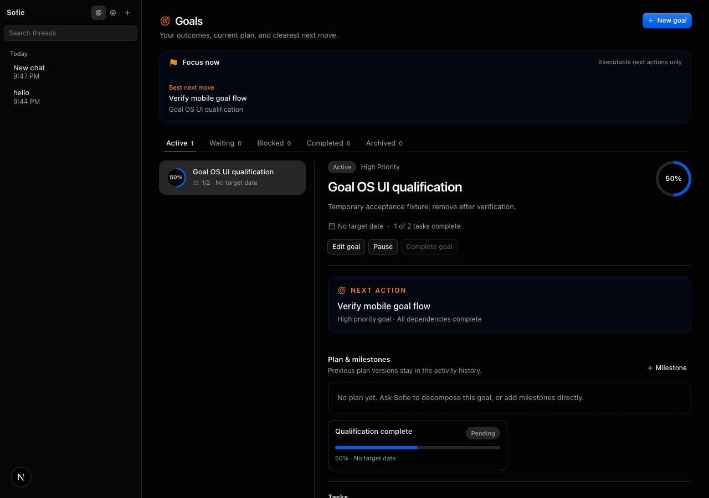
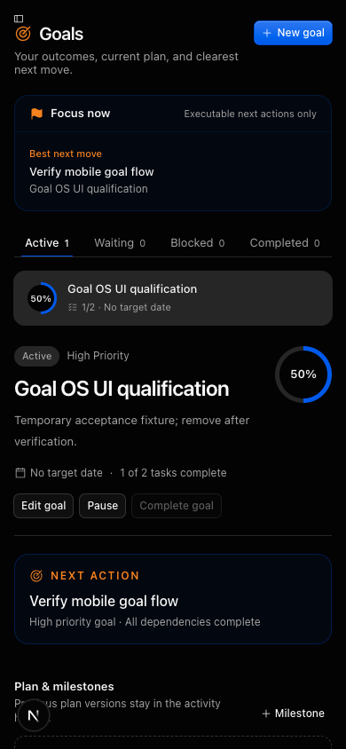

# Goal OS V1 qualification

Date: 2026-09-12 PDT  
Scope: local MyEve/Sofie deployment, configured Neon database, builder/template packaging  
Decision: **PASS for local V1; Preview promotion remains gated on a fresh isolated-Preview run**

## Result

Goal OS V1 is implemented and locally qualified. Goals persist outside chat, Focus excludes dependency-blocked work, progress is derived from task state, finalized goals reject structural mutation, agent and UI actions share the same owner-scoped repository, and every mutation creates an immutable event.

The product identity decision is also enforced: MyEve is the platform, Sofie is the reference/default agent, and Relay is the internal governed capability plane. New deployments use generic MyEve authentication identities while legacy Sofie environment variables and cookies remain accepted for upgrades.

## Release gates

| Gate | Result | Evidence |
| --- | --- | --- |
| Architecture and product hierarchy | PASS | Eight repository-specific documents, including `07-product-identity-and-tenancy.md` |
| Migration order/checksums | PASS | `npm run db:migrations:check --workspace=eve-agent`: 3 ordered migrations |
| Existing-database upgrade | PASS | `0003_goal_operating_system.sql` applied to the configured Neon database |
| Clean database and repeat apply | PASS | Migrations 0001–0003 applied to disposable PostgreSQL 17, then reapplied without failure |
| Unit/contracts | PASS | 27/27 Node tests |
| Real database lifecycle | PASS | 1/1 Neon integration test; dependency, Focus, progress, completion, immutable events, and finalized-state rejection |
| TypeScript | PASS | Both `eve-agent` and `eveclaw-builder` |
| Capability registry | PASS | 50 definitions; all 34 authored tools registered |
| Builder manifest | PASS | 52 prunable files claimed; template release 24 |
| Production build | PASS | Both Next.js applications compiled, typechecked, and prerendered |
| Browser UI | PASS | Desktop and 390 × 844 flows; clean final browser error log |
| Current-build agent E2E | PASS | Chat-created Goal, plan, milestone, two dependency-linked tasks, canonical reread, correct Next Action |
| Isolated Preview | NOT RUN | Requires a new Preview deployment and credentials; no deployment was authorized in this slice |

The clean-database test used `psql` because the checked-in migration runner uses Neon's HTTP driver and intentionally cannot connect to ordinary local PostgreSQL. This is a tooling limitation; the exact migration SQL passed both initial and repeat application. The disposable container and its temporary test password were removed immediately afterward.

## Golden path

The current application build received a natural-language request in web chat and used the Goal OS tools to:

1. Create a persistent owner Goal and link the current generic `webThreadId`.
2. Create plan version 1 and one milestone.
3. Create two tasks and make the second depend on the first.
4. Read the canonical Goal back from Neon.
5. Report task 1 as the current Next Action while correctly keeping task 2 blocked.

The run completed successfully with an estimated model cost of approximately $0.17. The exact Goal fixture, all cascade-owned plans/milestones/tasks/thread links/events, and the temporary chat thread were deleted after verification.

## Agent-native parity

| Owner outcome | UI | Agent capability | Shared authority boundary |
| --- | --- | --- | --- |
| Create a Goal | New goal dialog | `create_goal` | owner-scoped Goal repository |
| List/search Goals | status tabs and list | `list_goals` | owner/status/query filters |
| Inspect Goal state | Goal detail | `get_goal` | canonical aggregate read |
| Edit/lifecycle | edit, pause/resume, complete/archive | `update_goal` | legal transition checks |
| Plans and milestones | Goal detail controls | `manage_goal_structure` | transactional state + event |
| Tasks | composer and status controls | `manage_goal_task` | dependency/capability validation |
| Dependencies | task composer | `manage_goal_structure` | same-goal and cycle checks |
| Focus | Focus panel | `goal_focus` | deterministic ranking with `whyNow` |

Result: **PASS.** No owner-visible Goal outcome is UI-only, and agent writes appear through the same APIs/repository the UI reads.

## UI evidence

The final post-cleanup browser pass showed the explicit empty state, configurable Sofie/Jay display identity, Goals navigation, and zero page errors.

## Defects found and fixed during qualification

- Neon returned date-only values in a shape the repository treated as timestamps. Date normalization now preserves `YYYY-MM-DD`.
- Root discriminated-union tool schemas were rejected by the Anthropic Gateway because the generated root schema lacked `type: object`. Goal action tools now use object roots plus explicit action validation.
- Literal Sofie/Jay auth naming coupled deployments to the reference agent. New auth keys/cookie, QA identity assertions, UI copy, tool descriptions, and builder defaults are now deployment-aware with legacy compatibility.
- Hot reload left the local Eve subprocess unavailable while Next.js remained healthy. A clean restart restored the agent endpoint; `/eve/v1/info` returned 200 before the final agent run.

## Known limits and next gate

- Goal OS V1 remains single-owner per deployment by default.
- Persisted agent identities, agent groups, Relay grants, and multi-account policy bindings are deliberately deferred until the first real additional-agent flow.
- Outcomes, Daily Brief, Weekly Review, stalled/deadline risk, and governed learning are V1.1/V1.2 work.
- Before Preview promotion, deploy an isolated candidate and rerun the existing three-specialist six-check QA contract. The historical Preview report remains a NO-GO until replaced by fresh evidence.
