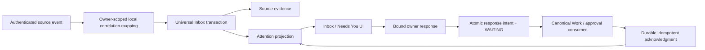

# Digital Worker attention integration

Only the middle attention domain and integration contracts are implemented here. Production source ingestion and canonical Work continuation are owned integration gates.

Before enabling production, the source owner must authenticate and authorize the envelope, resolve its local owner/account and Work, allocate a stable correlation sequence, then call `ingest`. Never derive owner or local authority from peer content. The Relay normalizer carries caller identity and grant provenance but imports no Relay executor, private peer state, or permission mutator.

Work remains canonical. An owner response carries `response.id`, `ownerId`, `workId`, `itemId`, action ID/binding, answer and created time. The consumer must validate the Work belongs to that owner, remains in the matching generation, still expects that exact decision, and may safely accept it. It must commit the answer/context and its dedupe receipt together. Canonical Work decides whether/how to continue. The Inbox changes no Work or Factory state and calls no execution route.

For approvals the consumer invokes the existing approval service before handing context to Work. Work still validates current authority before any consequential action. For credentials and account actions the response cannot contain or confer credentials; the canonical account flow must verify completion. For recovery the canonical service determines safe choices and must forbid blind retries of uncertain external effects.

Source supersession is a newer explicit settlement. It cancels a queued response; an in-flight consumer must rely on its canonical generation checks. Source recovery/expiry reconciliation is required before production launch. Do not add a scheduler or duplicate delivery outbox in the UI layer: existing schedule and notification services retain that responsibility.
